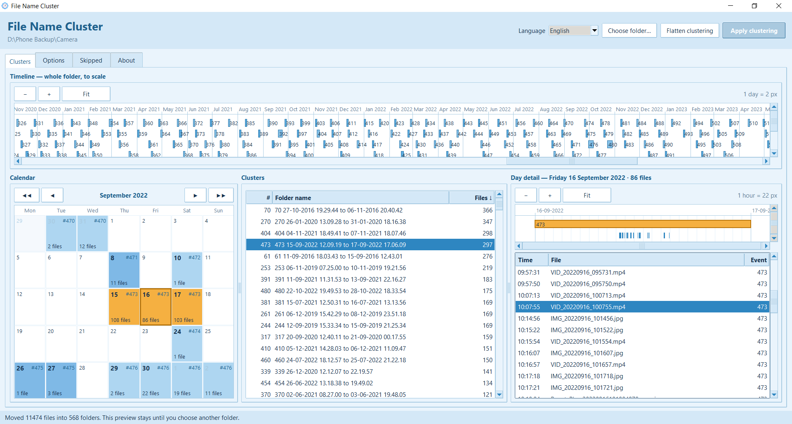
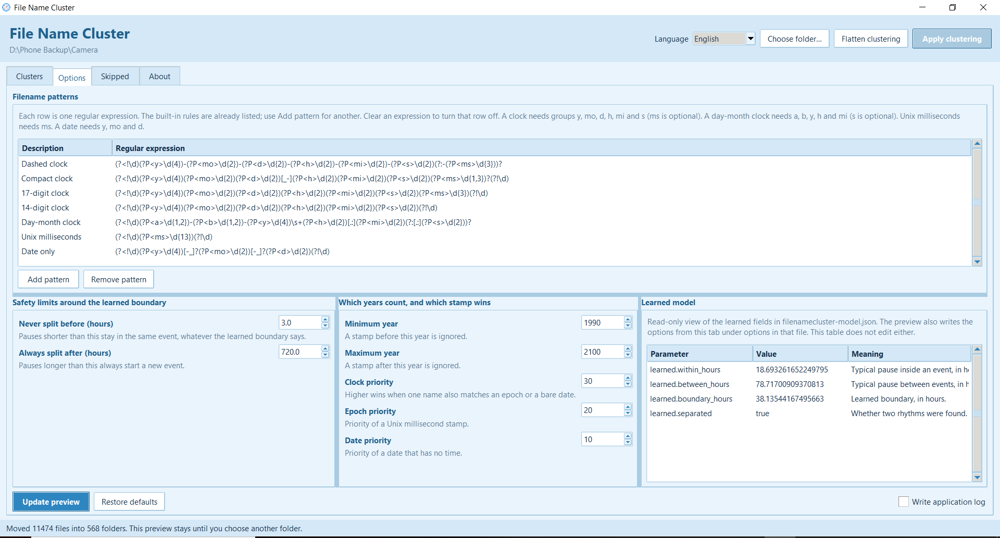

# File Name Cluster

<p align="center">
  
</p>

Rajas Chavadekar (rvchavadekar@gmail.com) · [LinkedIn](https://www.linkedin.com/in/rvchavadekar)

File Name Cluster groups photos, videos, PDFs, and other timestamped files in one folder into events, using the date and time written in each filename. If a name has no timestamp, it reads only the capture time from a recognised picture or video container, or the CreationDate from a PDF. It learns the boundary between a short pause and a long pause from that folder alone, draws the events to scale, and moves each event into its own folder when you ask it to.

The metadata reader is implemented with the Python standard library. It supports JPEG, PNG, WebP, TIFF, HEIF/AVIF, MP4, MOV, M4V, 3GP, AVI, and PDF. It does not inspect pixels, GPS, camera details, document contents, or filesystem dates. A file with no usable filename or metadata capture time remains in place and appears under **Skipped**.

<p align="center">
  
</p>

The Clusters tab. The timeline is the whole folder, to scale. The calendar colours each day by its event. The day detail is that day from 00:00 to 24:00. The cluster list sorts by event number (`#`) or by file count (`Files`): click a heading, then click it again to reverse the order. ↑ and ↓ show the direction. The events with the most files are the major ones, so sorting `Files` downward brings those to the top.

## Documents

| | |
|---|---|
| This file | [README.md](README.md) |
| The mathematics | [algorithm.md](docs/algorithm.md) |
| Components, classes, HLD, LLD | [architecture.md](docs/architecture.md) |
| Releases and tags | [devops.md](docs/devops.md) |
| Version history | [changelog.md](docs/changelog.md) |

This readme is at the project root. `algorithm.md`, `architecture.md`, `devops.md`, and `changelog.md` live in `docs/`, beside `workspace` and `filenamecluster`.

## Run it

From `workspace`, with [uv](https://docs.astral.sh/uv/):

```bash
uv run filenamecluster
```

The interpreter is the uv-managed Python, which has Tk. Choose a folder in the window. A dialog plays `spinner.gif` while that folder is read, then the preview appears. The cluster list matches extra words on event folders from one listing of that folder, so the dialog leaves when the scan finishes. It does not search the folder again for every event. **Apply clustering** and **Flatten clustering** each show the spinner while the folder is read, before the confirmation of which files will move. After you confirm, any filename the destination already has opens a replace-or-skip dialog: replace that file, skip it, or, when several names clash, do that for all of them. Closing the dialog moves nothing. The spinner then plays again while the files that will move are moved. The spinner is a borderless, see-through overlay with a large bold line that says what is happening, for example whether event clusters are being calculated or files are being moved. The work runs on a background thread, so the window stays responsive. Buttons and option controls are disabled until each wait finishes. Other subfolders are left alone.

After Apply, the preview stays until you choose another folder. Copy a later batch into the same folder and click **Update preview**. Files already inside event folders are included. A new file joins an existing event when the pause is short enough, or starts a new one when it is not. Apply then moves only the files that need a different folder. A new photo can join an older event and extend that event’s time span; the event folder is then renamed. Words added before the dates, after them, or on both sides stay on the updated folder. A new photo sitting loose in the album does not remove those words. When photos from two such folders fall into one event, the words kept are the ones on the folder that already held more of those photos. When both folders held the same number, the words on the earlier photos stay. If one such folder becomes two events, both new folders keep the same words. Flatten warns that those words are removed with the folder. If the destination already has the same filename, Apply asks whether to replace it or skip it, instead of stopping.

Double-click the selected orange or yellow event in the calendar, either timeline, or the cluster list to open its folder in a new file-manager window. The app explains when that folder has not been created yet. Double-click a file in **Day detail** to open it with the operating system's default application.

<p align="center">
  
</p>

The Options tab keeps one arrangement. Filename patterns span the top. Under them, three columns hold the safety limits, the year window, and the learned model. The row sash and the two column sashes are resizable, and the panes stretch when the window does. The two safety limits wrap the learned boundary: never split before 3 hours, always split after 720 hours. The year window and priorities start with built-in values. Filename patterns are editable rows in a table with descriptions; additional rules can be added and custom rows can be removed. The model table is read-only and lists the learned fields (`learned.within_hours`, `learned.between_hours`, `learned.boundary_hours`, `learned.separated`) at the same precision as the file. Before a folder is chosen the values are blank; when the folder has no fitted boundary they read `null`. Choosing a folder loads that folder's saved options over the built-in defaults. **Update preview** redraws with the current values and refreshes the model table. **Restore defaults** puts the built-in values back and the next preview writes those defaults into the file.

## What gets written

In the folder you chose, next to the files, not hidden:

```json
{
  "learned": {
    "within_hours": 17.55637365032029,
    "between_hours": 81.12551521324934,
    "boundary_hours": 37.98317023002044,
    "separated": true
  },
  "options": {
    "floor_hours": 3.0,
    "ceiling_hours": 720.0,
    "min_year": 1990,
    "max_year": 2100,
    "prec_clock": 30,
    "prec_epoch": 20,
    "prec_date": 10,
    "rules": [
      {
        "key": "clock_separated",
        "description": "Dashed clock",
        "pattern": "(?<!\\d)(?P<y>\\d{4})-..."
      }
    ]
  }
}
```

`filenamecluster-model.json` keeps the fitted hours at full precision. The Options tab lists those four learned fields in a read-only table with the same digits. A later batch that is too small to fit a new boundary reuses these numbers. The `options` object beside `learned` stores the safety limits, year window, priorities, and every filename-pattern row last used for this folder. Choosing the folder loads them over the built-in defaults. An older file that has only `learned` still loads, and a broken `options` object does not discard the saved boundary. The scan ignores this filename, so it is not treated as media.

The About tab has a separate guide to the filename regular expressions, in short sections with two worked examples, and it states the full path of the application log for this computer. Options includes **Write application log**, which is off when the app opens. On macOS that file is `~/Library/Logs/filenamecluster/filenamecluster.log`. On Windows it is `%LOCALAPPDATA%/filenamecluster/Logs/filenamecluster.log`. On Linux it is `$XDG_STATE_HOME/filenamecluster/filenamecluster.log`, or `~/.local/state/filenamecluster/filenamecluster.log` when `XDG_STATE_HOME` is unset.

Event folders are named so a plain sort follows time:

```text
1 24-11-2015 10.01.25 to 18.50.08
2 09-11-2015 20.49.41 to 12-11-2015 10.24.42
```

Words may sit before those dates, after them, or on both sides, separated by a space. `Hyderabad trip 1 24-11-2015 10.01.25 to 18.50.08` and `2 09-11-2015 20.49.41 to 12-11-2015 10.24.42 evening` are still event folders. The cluster list shows the dates. The folder on disk keeps the words, and double-click opens that folder. The Skipped tab does not list that folder, because its files are already in the events. Apply keeps the words when it updates the folder. Flatten removes them, and the confirmation says so before anything moves.

## Layout

```text
filenamecluster/
  README.md             this introduction
  docs/                 algorithm, architecture, changelog, devops, assets
  filenamecluster/      the package and the Tk app
  workspace/            uv project that runs the app; data/ and filenames.txt
```

`workspace` installs `filenamecluster` from the sibling directory. `uv run stub create filenames.txt` builds empty stand-in files in `workspace/data` from a `dir` listing, `ls -l` output, or one name per line. `uv run stub clean` deletes empty files there, then empty folders, and leaves anything that still has content. `.gitkeep` is never deleted.

## Tests

From `filenamecluster`:

```bash
uv run pytest
```

Coverage is written to `filenamecluster/reports/`. The whole suite is required to stay at or above 80%. The `filenamecluster.core` package, which scans, clusters, and moves files, is required to stay at 100%. The tests follow the same folders as `src/filenamecluster`, including `ui/model`, `ui/view`, and `ui/controller`. UI tests build real Tk widgets on a root that remains withdrawn, so the suite never presents an application window.
