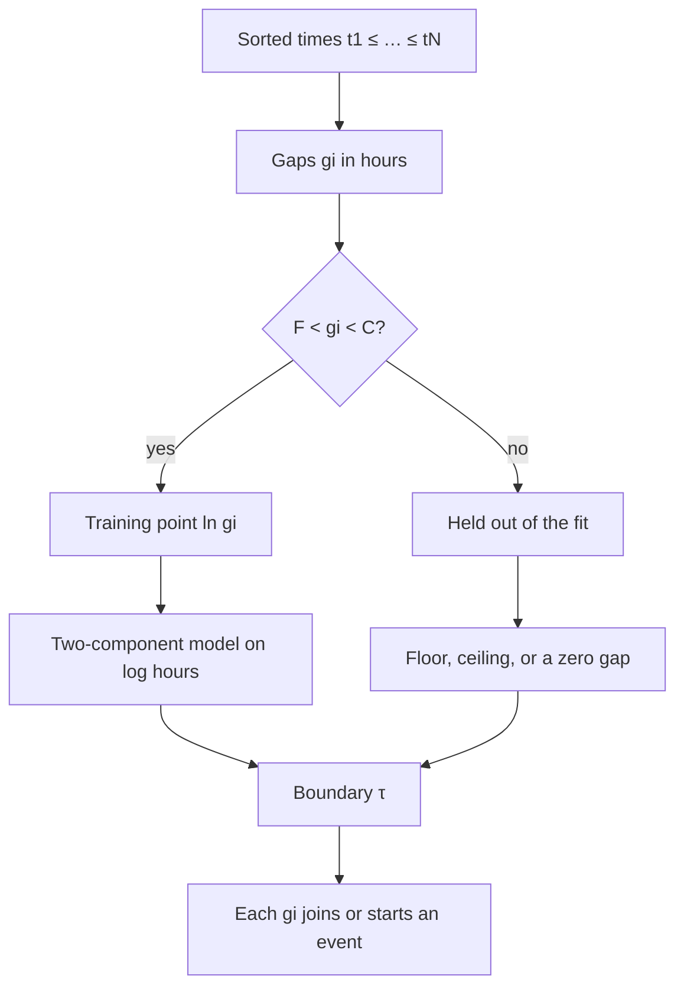
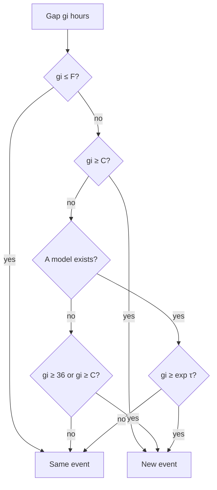

# Event boundary

Rajas Chavadekar (rvchavadekar@gmail.com)

A folder is one sequence of capture times. The only observation used by the clustering model from file $i$ is its timestamp $t_i$. The filename is tried first. If it has no timestamp, the metadata reader may supply only the capture time from a recognised picture or video, or the CreationDate from a PDF. Pixels, location, camera details, document contents, and filesystem dates are not variables in this model.

Line numbers below are the current source under `filenamecluster/src/filenamecluster/core/`.

> **In simple words.** Imagine a big box of photos, videos, and PDFs. A file may have a little clock written in its name, like `IMG_20240101_101500.jpg`, which means “1 January 2024, 10:15:00”. The app tries that clock first. If the name has none, it can read only the capture-time field from recognised picture or video metadata, or the creation date from PDF metadata. It never looks at pixels or document contents, so it does not know what a file shows or says.
>
> The job is to put the photos into small piles called **events**. One event is one outing: a birthday party, a trip to the park, a wedding. Photos taken close together in time go in the same pile. When there is a long quiet time with no photos, a new pile starts.
>
> The hard question is: **how long is “long”?** Someone who takes photos every day and someone who takes photos once a month need different answers. So the app does not use one fixed number for everyone. It looks at *your* folder and learns the answer from *your* photos. That learned answer is called the **boundary**.

### The whole story in six steps

> 1. **Line up** every photo by its clock, oldest first.
> 2. **Measure the waits.** For each pair of neighbours, work out how many hours passed between them.
> 3. **Throw away the obvious ones.** Tiny waits (a few seconds or minutes) are clearly the same outing. Huge waits (more than 30 days) are clearly different outings. We do not need to learn anything from those.
> 4. **Look at the middle waits** and notice that they come in two families: “short-ish” waits inside an outing, and “long-ish” waits between outings.
> 5. **Find the dividing line** between the two families. That line is the boundary.
> 6. **Walk along the line of photos.** Every time a wait is longer than the boundary, start a new pile.

## The algorithm in pseudocode

The six steps above, in the order the code runs them. Names match `cluster_files`, `fit_gap_model`, and `GapModel.splits`. Later sections derive each line.

```text
cluster(files, F = 3 h, C = 720 h, saved):
    ordered ← sort files by (timestamp, filename)
    if |ordered| < 2: return one cluster, or none
    g_i ← (t_{i+1} − t_i) / 3600          for i = 1 … N−1
    U ← { ln g_i : F < g_i < C }
    model ← fit(U)
    if model is missing and saved exists:
        model ← saved                     # not used inside fit
    groups ← [[ordered_1]]
    for each gap g_i:
        if split(g_i, model, F, C):
            start a new group with file i+1
        else:
            append file i+1 to the current group
    return groups, model

fit(U):
    if |U| < 4: return nothing
    sort U; L ← lower half; H ← upper half    # each half has ≥ 1 point
    μ_w, σ_w² ← mean and variance of L, variance ≥ 0.05
    μ_b, σ_b² ← mean and variance of H, variance ≥ 0.05
    π_w ← 1/2
    repeat 25 times:
        for each x in U:
            r_w(x) ← short-pattern share       # Bayes, in log space
            r_b(x) ← 1 − r_w(x)
        if either total share < 10⁻⁶: stop
        μ_w, σ_w², π_w ← weighted updates, variance ≥ 0.05
        μ_b, σ_b² likewise from r_b
        if μ_w > μ_b: swap the two patterns
    separated ← (μ_b − μ_w ≥ 1) and (0.05 < π_w < 0.95)
    if separated:
        τ ← log-gap where the two patterns are equally likely
        # root of aτ² + bτ + c = 0 that lies in (μ_w, μ_b), else the midpoint
    else:
        x̄, s ← mean and spread of U, s ≥ √0.05
        τ ← x̄ − ½s    if x̄ ≥ ln 18
        τ ← x̄ + 2s    otherwise
    return (e^{μ_w}, e^{μ_b}, e^τ, separated)

split(g, model, F, C):
    if g ≤ F: return false                 # same event, including g = 0
    if g ≥ C: return true                  # new event
    if model is missing: return g ≥ 36
    return g ≥ e^τ
```

## Why this approach was needed

### Requirements that shaped it

This algorithm was not chosen in a vacuum. The useful solution had to satisfy all of these constraints at once:

1. **Use timestamps only.** The preferred observation is a timestamp parsed from a filename. If the name has none, a standard-library reader may extract only the capture time from recognised image or video metadata, or CreationDate from a PDF. The program must not decode pixels or document contents, use GPS, camera details, faces or objects, scan arbitrary files for metadata, or fall back to filesystem creation and modification dates.
2. **Work for different shooting habits.** One person may take hundreds of photographs per day; another may leave several days between photographs from the same trip. One universal gap such as 12 or 24 hours cannot fit both.
3. **Keep chronological events contiguous.** After sorting by time, an event must be one uninterrupted interval. This is segmentation of a sequence, not arbitrary clustering where photo 1 and photo 100 can join while the photos between them do not.
4. **Be deterministic and explainable.** The same names and settings must produce the same folders. The learned boundary must be visible as a number that can be explained and audited.
5. **Run locally with no training service.** It must work offline, with Python's standard library, on one folder at a time. There is no labelled training set and no global model downloaded from somewhere else.
6. **Remain safe on strange folders.** A burst of near-identical times must not create hundreds of events. A many-month gap must not be joined merely because a fitted model is poor. Too few useful gaps must not produce a confident but meaningless fit.
7. **Accept later batches.** Existing event folders and newly copied files must be put back into one chronological sequence. With enough evidence the model should refit; without enough evidence it should reuse the last boundary.
8. **Scale linearly after sorting.** Thousands of files should be ordinary work. The algorithm should not compare every file with every other file.

The timestamp-only requirement is the most restrictive one. A human can see that two photos show the same birthday cake. This program cannot. It can only see that their clocks are close. Therefore this is a **temporal event segmenter**, not a semantic understanding system.

### Why not just use a fixed number?

The simplest possible method is:

```text
start a new event whenever the gap is at least 24 hours
```

That is simpler than this algorithm, and it is a reasonable baseline. It fails when “normal” means different things in different folders:

- A frequent photographer can have unrelated occasions only 10 hours apart. A 24-hour rule joins them.
- A sparse traveller can have two or three quiet days inside one trip. A 24-hour rule splits it.
- Changing the fixed number repairs one behaviour by damaging the other.

The floor, ceiling, and 36-hour fallback deliberately retain fixed rules only where they are useful: as safety rails and as a last resort when there is too little evidence to learn.

### Simpler adaptive alternatives

Several methods are simpler than the two-component model but lose something important.

**Largest-gap rule.** Split at the largest gap, or at the largest few gaps. This requires choosing the number of events in advance. One enormous outlier can also make every other genuine boundary look small.

**Mean or median times a constant.** Split when

$$
g_i > k\,\mathrm{median}(g).
$$

This adapts to the overall pace, but the constant $k$ is still universal. It assumes one rhythm plus outliers rather than explicitly representing both within-event and between-event rhythms.

**A percentile.** Split above, for example, the 90th percentile. This forces roughly 10% of eligible gaps to split even when a folder is one continuous trip, and can force too few splits when a folder contains many separate occasions.

**Two-means on $\ln g$.** This is close and computationally simpler. It gives two centres, but assumes equally shaped spherical groups and normally places the boundary halfway between their centres. It does not account for unequal variances or unequal frequencies.

**A histogram valley.** Build bins of log gaps and choose the lowest bin between two peaks. The answer changes when bin width or bin origin changes, especially with only a few dozen gaps.

**A change-point model.** A Bayesian or dynamic-programming change-point method could model local changes in shooting rate. It is more flexible but requires more assumptions, penalties, and implementation machinery. For this application, every possible boundary already has one direct observation—the adjacent time gap—so that complexity is difficult to justify.

**Visual or location clustering.** Image embeddings, GPS, faces, colour, and non-time metadata would often improve semantic quality. They directly violate the input and privacy requirements here. EXIF is used only as a fallback source for its capture-time tag.

### Why two Gaussians on log gaps?

This choice is the smallest probabilistic model that says exactly what the application needs:

- There are two possible explanations for an eligible pause: **inside an event** or **between events**.
- Each explanation can have its own centre, spread, and frequency.
- A gap can belong partly to both while learning; EM does not have to make an early hard assignment.
- The boundary follows from equal posterior probability instead of an arbitrary midpoint.
- The model produces inspectable numbers in hours.

The logarithm is not cosmetic. Gaps are positive, right-skewed, and span orders of magnitude. A Gaussian on raw hours can be dominated by a few very large gaps and can assign probability to impossible negative gaps. A Gaussian on $\ln g$ corresponds to a log-normal model on $g$: positive, multiplicative, and right-tailed.

The complete cost is modest:

- parsing and collecting $N$ timestamps: $O(N)$;
- sorting: $O(N\log N)$;
- making the gaps: $O(N)$;
- 25 EM rounds over at most $N-1$ gaps: $O(25N)=O(N)$;
- producing events: $O(N)$.

Sorting therefore dominates the asymptotic running time. The model stores only the files, the gaps, the responsibilities, and a few parameters, so memory is $O(N)$.

### Is it the simplest suitable approach?

No, if “simplest” means the fewest lines: a fixed threshold wins.

Yes, approximately, if “simplest suitable” means the smallest method that is simultaneously folder-adaptive, probabilistic, deterministic, explainable, timestamp-only, and able to distinguish two rhythms with unequal spreads and weights. A two-component log-gap mixture is a restrained middle ground:

- more adaptive than a fixed threshold, percentile, or midpoint between two means;
- much less elaborate than semantic image analysis, location modelling, deep embeddings, or a supervised event classifier;
- small enough that every decision can be followed from a filename to one inequality.

The surrounding safety rules are important. A bare mixture model is not enough for production use: it can overfit tiny samples, collapse a variance, or let an extreme fitted boundary override common sense. The minimum sample, variance floor, separation check, hard floor and ceiling, saved-boundary reuse, and fallback turn the statistical fit into a predictable tool.

### Similar prior work and products

This project did **not** invent temporal photo-event clustering. The core idea—sort photographs by time, examine adjacent gaps, and use large gaps as event boundaries—has substantial prior art.

**Kodak event clustering.** Kodak's [US 6,606,411](https://patents.google.com/patent/US6606411B1/en) describes computing time differences between adjacent pictures, scaling or compressing large differences, making a time-difference histogram, and using two-means clustering to separate small and large gaps. That is very close in purpose. This implementation differs in its exact model: individual log gaps rather than a binned scaled histogram, a two-Gaussian mixture fitted with EM rather than two-means, an equal-posterior boundary, and explicit safety and incremental-reuse rules. Those are engineering and statistical choices, not evidence that the broad idea is new.

**Microsoft PhotoTOC.** Platt, Czerwinski, and Field's 2002 [PhotoTOC technical report](https://www.microsoft.com/en-us/research/wp-content/uploads/2002/02/tr-2002-17.pdf) sorts photos by creation time and detects a boundary when a log gap is much larger than a local average of nearby log gaps. It used a local threshold with empirically chosen constants and also used colour to split large clusters. This project shares the log-gap insight but learns one folder-wide two-pattern distribution and never reads visual content.

**Adobe Lightroom Classic.** Adobe documents [automatic stacking by capture time](https://helpx.adobe.com/lightroom-classic/help/auto-stack.html): users select time as a criterion and adjust a slider for the interval. Lightroom can also use visual similarity. Its time method is user-tuned stacking rather than a learned event boundary, and it reads normal photo metadata rather than timestamps specifically recovered from filenames.

**Google Photos.** Google documents [Photo Stacks](https://blog.google/products-and-platforms/products/photos/google-photos-organization-updates-november-2023/) as grouping similar photos taken close together and selecting a top pick with AI. That solves burst and duplicate-like clutter rather than this project's broader outing segmentation. It can inspect visual content; this project intentionally cannot.

**Apple Photos.** Apple's [Trips collections](https://support.apple.com/guide/photos/find-your-travel-photos-and-videos-phtacde28864/mac) group travel photos based on location data. That richer signal can recognize travel semantics that timestamps alone cannot. It also means the feature is not an equivalent timestamp-only local algorithm.

**digiKam.** The digiKam manual documents a [timeline histogram](https://docs.digikam.org/en/left_sidebar/timeline_view.html) and [grouping by time](https://docs.digikam.org/en/main_window/image_view.html). Its time grouping is aimed at near-simultaneous shots and uses EXIF/XMP timestamps; its timeline supports date-range browsing. It is related workflow, not the same learned event model.

**Immich.** Immich lists a timeline, map, face grouping, duplicate detection, smart search, albums, and “on this day” [Memories](https://immich.app/features). Its roadmap separately lists future event-, location-, and people-based memories. It is a much broader self-hosted photo platform; this tool is a narrow filesystem organiser.

### Is this algorithm advanced?

It depends on the comparison:

- **Compared with a shell script using a 24-hour cutoff:** yes. It learns a per-folder boundary, models uncertainty, permits unequal spreads and frequencies, checks whether two patterns actually separated, and persists a fallback model.
- **Compared with two-means or a user-controlled time slider:** it is statistically richer. The equal-posterior boundary can move away from the midpoint when one pattern is wider or more common.
- **Compared with consumer photo intelligence from Apple, Google, or Adobe:** no. Those systems can use pixels, embeddings, locations, faces, duplicate detection, quality scoring, and large trained models. They can answer semantic questions that timestamp gaps cannot.
- **Compared with current research:** no. A two-component Gaussian mixture fitted by EM is standard statistical machinery. Applying it to log time gaps is sensible and useful, but not a new class of machine-learning algorithm.

The honest description is: **an adaptive, privacy-preserving, filename-first temporal clustering tool with careful product safeguards**. Its strength is not state-of-the-art intelligence. Its strength is achieving useful, explainable event folders under unusually strict constraints—without reading visual content, uploading files, or asking the user to tune the boundary by hand.

### What the letters mean

> | Symbol | Say it as | What it means in plain words |
> |---|---|---|
> | $t_i$ | “t sub i” | The clock time of photo number $i$. |
> | $N$ | “N” | How many photos there are. |
> | $g_i$ | “gap i” | How many hours you waited between photo $i$ and the next photo. |
> | $F$ | “floor” | A wait this short or shorter is **always** the same event (3 hours unless you change it). |
> | $C$ | “ceiling” | A wait this long or longer is **always** a new event (720 hours = 30 days unless you change it). |
> | $\ln$ | “natural log” | A way of shrinking big numbers so that 1 hour, 10 hours, and 100 hours sit evenly spaced. |
> | $\mathcal{U}$ | “the training set” | The list of middle-sized waits the app learns from. |
> | $\mu$ | “mew” | The middle, or average, of a family of waits. |
> | $\sigma^2$ | “sigma squared” | How spread out a family is. Small means everyone is close to the middle. |
> | $\pi$ | “pie” (here, not 3.14) | What share of the waits belongs to a family. |
> | $w$, $b$ | “within”, “between” | Tags for the short family (waits *within* an event) and the long family (waits *between* events). |
> | $\tau$ | “tau” | The boundary: the dividing line between short waits and long waits. |
> | $e$ | “e” | A special number, about 2.718. $e^{x}$ undoes $\ln$. |

## 1. Ordered gaps

Sort so that $t_1 \le t_2 \le \cdots \le t_N$, breaking ties by filename. The pause after file $i$ is measured in hours:

> **In simple words.** First we line up the photos like children by height, except here we line them up by time: the earliest photo stands first, the latest stands last. If two photos have exactly the same clock, we put them in alphabetical order of their names, so the line is always the same every time.

$$
g_i = \frac{t_{i+1} - t_i}{3600}, \qquad i = 1,\ldots,N-1.
$$

> **In simple words.** Now we look at each photo and the one right after it, and ask “how long did we wait?” Clocks count in seconds, and there are 3600 seconds in one hour, so dividing by 3600 turns the wait into hours.
>
> If you have $N$ photos you get $N-1$ waits, because the last photo has nobody after it.
>
> Example: photos at 10:00, 10:30, and 16:30 give waits of 0.5 hours and 6 hours.

Code: sort in `cluster.py` line 79; $g_i$ in `cluster.py` lines 85–88.

Two safety limits are fixed before the fit. By default the floor is $F = 3$ hours and the ceiling is $C = 720$ hours (30 days), with $0 < F < C$.

> **In simple words.** Before learning anything, we set two safety rails, like the bumpers in a bowling lane.
>
> - The **floor** $F$ says: “If you waited 3 hours or less, it is the same outing. Do not even think about it.”
> - The **ceiling** $C$ says: “If you waited 30 days or more, it is a different outing. Do not even think about it.”
>
> The floor must be bigger than zero, and the ceiling must be bigger than the floor. Otherwise the rails would make no sense.

Code: defaults in `cluster.py` lines 32–33; the check $0 < F < C$ in lines 35–39; conversion to hours in lines 41–47.

The fit does not see bursts of a few seconds, and it does not see pauses already long enough to be a hard boundary. The training sample is

$$
\mathcal{U} = \{\ln g_i : F < g_i < C\}.
$$

> **In simple words.** When you press the camera button ten times in a row, you get ten waits of one second each. Those tell us nothing about where outings begin and end, so we skip them. Waits longer than the ceiling are already decided, so we skip those too.
>
> What is left is the interesting middle: waits bigger than 3 hours and smaller than 30 days. That middle list is $\mathcal{U}$, the **training set**, which just means “the examples we learn from”.
>
> We also take the natural log ($\ln$) of each wait. Why? Because waits come in wildly different sizes. Without the log, a 600-hour wait would squash everything else into a tiny corner. With the log, the numbers become friendlier:
>
> | Wait in hours | $\ln$ of it (about) |
> |---|---|
> | 3 | 1.10 |
> | 10 | 2.30 |
> | 18 | 2.89 |
> | 36 | 3.58 |
> | 100 | 4.61 |
> | 720 | 6.58 |
>
> Now “3 hours versus 10 hours” and “100 hours versus 330 hours” look like the same size of step, which is how people actually feel about waiting.

Code: `cluster.py` lines 89–93. That list is passed to `fit_gap_model` at line 94.

#### Derivation: what a Gaussian on $\ln g$ means for $g$

Gaps are positive and act multiplicatively: going from 3 h to 6 h feels like going from 30 h to 60 h. Put $x = \ln g$ and assume $x \sim \mathcal{N}(\mu,\sigma^2)$. Change variables with $g = e^{x}$, $dx/dg = 1/g$:

$$
p_g(g) = p_x(\ln g)\,\left|\frac{dx}{dg}\right|
= \frac{1}{g\sqrt{2\pi\sigma^2}}\exp\!\left(-\frac{(\ln g-\mu)^2}{2\sigma^2}\right), \qquad g > 0.
$$

That is the log-normal density. It is zero for $g \le 0$ and has a long right tail, which is the shape of real waiting times. Its median follows from $P(g \le m) = P(x \le \ln m) = \tfrac12$, which holds at $\ln m = \mu$:

$$
\mathrm{median}(g) = e^{\mu}.
$$

This is why section 7 reports $e^{\mu_w}$ and $e^{\mu_b}$ as “typical” hours. They are medians, not means. The mean would be $e^{\mu+\sigma^2/2}$, which a few very long gaps pull upward.

> **The picture below, in simple words.** Start with the line of photos. Measure each wait. Ask “is this wait in the interesting middle?” If yes, it goes into the learning pile. If no, it is set aside because the rails already decide it. The learning pile teaches us the boundary. Then every wait, whether it was in the learning pile or not, is checked against the rules to decide “same outing” or “new outing”.



## 2. Two patterns on the log gap

> **In simple words.** Think about how you take photos. At a party you might take a photo, then another one 4 hours later when the cake comes out. Those are **short-ish waits**. Then you go home, and the next photo is at a different party five days later. That is a **long-ish wait**.
>
> If you drew a bar chart of all your middle-sized waits, you would usually see **two hills**: one hill of short-ish waits on the left, and one hill of long-ish waits on the right. This section describes those two hills with math.

Each training point $x \in \mathcal{U}$ is treated as a draw from a two-component Gaussian mixture

$$
p(x) = \pi_w\,\mathcal{N}(x;\mu_w,\sigma_w^2) + \pi_b\,\mathcal{N}(x;\mu_b,\sigma_b^2),
$$

$$
\pi_b = 1 - \pi_w, \qquad \pi_w \in (0,1).
$$

> **In simple words.** A **Gaussian** is the smooth hill shape you get when you measure lots of similar things, like the heights of children in a class: most are near the middle, fewer are very short or very tall. It is also called a **bell curve** because it looks like a bell.
>
> A **mixture** of two Gaussians just means “two bell curves added together”. So the formula says:
>
> - Some share $\pi_w$ of the waits come from the short hill (inside an event).
> - The rest, $\pi_b$, come from the long hill (between events).
> - The two shares add up to 1 (all of the waits), so $\pi_b = 1 - \pi_w$.
>
> For example, if $\pi_w = 0.7$, then 7 out of 10 middle-sized waits look like “still at the same outing”, and 3 out of 10 look like “moved on to a new outing”.

Code: $\pi_b = 1-\pi_w$ in `learn.py` lines 115 and 146–147. The mixture is not a separate function; it is the denominator of the responsibility in `learn.py` lines 136–150.

$\mu_w$ is the short pattern (a pause inside an event). $\mu_b$ is the long pattern (a pause between events). The component density is

> **In simple words.** Each hill has two numbers that describe it:
>
> - Its **middle**, $\mu$. Where is the top of the hill?
> - Its **width**, $\sigma^2$. Is the hill skinny and tall, or wide and flat?
>
> $\mu_w$ is the middle of the short hill, and $\mu_b$ is the middle of the long hill.

$$
\mathcal{N}(x;\mu,\sigma^2)
= \frac{1}{\sqrt{2\pi\sigma^2}}
\exp\!\left(-\frac{(x-\mu)^2}{2\sigma^2}\right).
$$

> **In simple words.** This is the exact shape of one bell. Read it as: “How tall is the hill at the spot $x$?”
>
> - $(x-\mu)^2$ is how far $x$ is from the middle, squared so that left and right count the same.
> - Dividing by $2\sigma^2$ means a wide hill forgives distance more than a skinny hill does.
> - $\exp(-\ldots)$ makes the height drop quickly as you move away from the middle.
> - The fraction in front just makes sure the whole hill has a total area of 1.
>
> So a wait right at the middle of a hill gets a big number, and a wait far away gets a tiny number.

Its log is

$$
\log \mathcal{N}(x;\mu,\sigma^2)
= -\frac12\left(\log(2\pi\sigma^2) + \frac{(x-\mu)^2}{\sigma^2}\right).
$$

> **In simple words.** Computers get confused by numbers that are extremely tiny, like 0.000000000000001. Taking the log turns those into ordinary negative numbers, like −34, which the computer handles easily. Bigger log still means “more likely”, so comparisons still work.

Code: the log density is `_log_density` in `learn.py` lines 153–154. The exponential form of $\mathcal{N}$ is not written out; every comparison uses this log.

#### Derivation: the log density

Take $\log$ of the product. The log of a product is a sum, and $\log e^{y} = y$:

$$
\log \mathcal{N}(x;\mu,\sigma^2)
= \log\!\left((2\pi\sigma^2)^{-1/2}\right) + \left(-\frac{(x-\mu)^2}{2\sigma^2}\right)
= -\frac12\log(2\pi\sigma^2) - \frac{(x-\mu)^2}{2\sigma^2}.
$$

Factor out $-\tfrac12$ to get the form above. Line 154 computes exactly this.

If $|\mathcal{U}| < 4$, the mixture is not fitted.

> **In simple words.** $|\mathcal{U}|$ means “how many waits are in the learning pile”. With fewer than 4 examples you cannot honestly see two hills, just like you cannot tell the shape of a mountain range from 3 pebbles. So the app does not guess. It reuses what it learned before for this folder, or uses a simple backup rule (see section 7 and section 8).

Code: `learn.py` lines 55–56 return `None`. The caller then either reuses a saved boundary or falls back, in `cluster.py` lines 94–105.

## 3. Initialisation

> **In simple words.** We do not know where the two hills are yet. So we make a first rough guess, then improve it in section 4. This section is the rough guess.

Sort $\mathcal{U}$ into $x_{(1)} \le \cdots \le x_{(n)}$ and cut it in half:

$$
L = \{x_{(1)},\ldots,x_{(\lfloor n/2 \rfloor)}\}, \qquad
H = \{x_{(\lfloor n/2 \rfloor+1)},\ldots,x_{(n)}\},
$$

> **In simple words.** Line up the learning waits from smallest to biggest. Cut the line in the middle. The smaller half is $L$ (low), the bigger half is $H$ (high). $\lfloor n/2 \rfloor$ means “half of $n$, rounded down”, so with 7 waits the low half gets 3 and the high half gets 4.

with each half forced to contain at least one point. Then

$$
\mu_w^{(0)} = \frac{1}{|L|}\sum_{x\in L} x, \qquad
\mu_b^{(0)} = \frac{1}{|H|}\sum_{x\in H} x,
$$

> **In simple words.** The first guess for the middle of the short hill is the plain average of the low half. The first guess for the middle of the long hill is the plain average of the high half. $\sum$ means “add them all up”, and dividing by $|L|$ or $|H|$ (how many there are) makes it an average. The little $(0)$ means “guess number zero”, the very first try.

$$
\sigma_w^{2\,(0)} = \max\!\left(\frac{1}{|L|}\sum_{x\in L}(x-\mu_w^{(0)})^2,\; 0.05\right),
$$

and the same for $\sigma_b^{2\,(0)}$ on $H$. The variance floor $0.05$ stops a run of identical gaps from collapsing a component to a spike. The starting weight is $\pi_w^{(0)} = 1/2$.

> **In simple words.** The first guess for how wide each hill is: take every wait in the half, see how far it is from that half’s average, square it, and average those. That is called the **variance**.
>
> There is one safety trick. If all the waits in a half were exactly the same, the width would be zero, and the hill would become an infinitely thin needle. That breaks the math. So the width is never allowed below 0.05. That is what $\max(\ldots, 0.05)$ means: “use the bigger of the two”.
>
> Finally, we start by saying each hill owns half the waits: $\pi_w = 1/2$. It is a fair, neutral start.

Code: the half split is `learn.py` lines 58–60; the two means lines 61–62; both variances lines 63–64; $\pi_w^{(0)} = 1/2$ at line 65. `_mean` is lines 191–192 and `_variance` is lines 195–198. The floor constant is line 17.

#### Why these starting values

The split into halves is a design choice, not a derivation. It guarantees $\mu_w^{(0)} \le \mu_b^{(0)}$, so EM starts with the short pattern on the left.

The mean and the variance with divisor $|L|$ (not $|L|-1$) are the maximum-likelihood estimates for one Gaussian fitted to $L$. With $\ell(\mu,v) = \sum_{x\in L}\left(-\tfrac12\log(2\pi v) - \tfrac{(x-\mu)^2}{2v}\right)$:

$$
\frac{\partial \ell}{\partial \mu} = \sum_{x\in L}\frac{x-\mu}{v} = 0
\;\Rightarrow\; \mu = \frac{1}{|L|}\sum_{x\in L} x,
$$

$$
\frac{\partial \ell}{\partial v} = \sum_{x\in L}\left(-\frac{1}{2v} + \frac{(x-\mu)^2}{2v^2}\right) = 0
\;\Rightarrow\; v = \frac{1}{|L|}\sum_{x\in L}(x-\mu)^2.
$$

These are the special case of the EM updates in section 4 where every $r_w(x)$ is $1$ on $L$ and $0$ on $H$. `_variance` returns the floor directly when a half has fewer than two points, because one point has no spread.

## 4. Expectation–maximisation

> **In simple words.** Now we improve our rough guess by repeating two steps, like a game of “hot and cold”:
>
> 1. **Guess who belongs where (Expectation).** For every wait, ask “how much does this look like the short hill, and how much like the long hill?”
> 2. **Move the hills (Maximisation).** Slide and stretch each hill so it fits the waits that belong to it.
>
> Then do it again. And again. After a few rounds the hills stop moving much, because they fit the waits well. This method is called **Expectation–Maximisation**, or **EM** for short.

For 25 iterations, the responsibility of the short component at an unlabeled point is the two-class posterior

$$
r_w(x)
= \frac{\pi_w\,\mathcal{N}(x;\mu_w,\sigma_w^2)}
{\pi_w\,\mathcal{N}(x;\mu_w,\sigma_w^2)+\pi_b\,\mathcal{N}(x;\mu_b,\sigma_b^2)}.
$$

> **In simple words.** “25 iterations” means we play the two-step game 25 times.
>
> $r_w(x)$ is the **responsibility**: a number between 0 and 1 that says how much the short hill “owns” this wait.
>
> - The top of the fraction is “how strongly the short hill claims it”: how tall the short hill is at this spot, times how big the short hill’s share is.
> - The bottom is “the short hill’s claim plus the long hill’s claim”.
>
> So it is a fair split. If the short hill claims 3 and the long hill claims 1, the short hill gets $3/(3+1) = 0.75$ of this wait and the long hill gets 0.25.

In log space, with $\ell_w = \log\mathcal{N}(x;\mu_w,\sigma_w^2)+\log\pi_w$ and $\ell_b$ defined the same way,

$$
r_w(x) = \frac{1}{1+\exp(\ell_b-\ell_w)}
\quad\text{when }\ell_w \ge \ell_b,
$$

and the symmetric form when $\ell_b$ is larger. Then $r_b(x) = 1-r_w(x)$.

> **In simple words.** This is the same fair split, just computed with logs so the computer never has to handle super-tiny numbers (remember section 2). $\ell_w$ is the short hill’s claim written as a log, and $\ell_b$ is the long hill’s claim.
>
> The formula is arranged so the `exp` part is never asked to blow up into a gigantic number. When the long hill has the bigger claim, the same idea is written the other way round.
>
> Whatever share the short hill does not take, the long hill takes: $r_b = 1 - r_w$.

Code: `_responsibility` in `learn.py` lines 136–150. $\ell_w$ and $\ell_b$ are lines 144–147. The two branches of $r_w$ are lines 148–150. $r_b = 1-r_w$ is line 78.

#### Derivation: responsibility is Bayes’ rule

Give each gap a hidden label $z \in \{w, b\}$ with prior $P(z=w) = \pi_w$ and likelihood $p(x \mid z=w) = \mathcal{N}(x;\mu_w,\sigma_w^2)$, and the same for $b$. The total probability of $x$ is the mixture:

$$
p(x) = P(z=w)\,p(x\mid z=w) + P(z=b)\,p(x\mid z=b).
$$

Bayes’ rule, $P(z=w\mid x) = P(z=w)\,p(x\mid z=w)/p(x)$, gives $r_w(x)$ exactly as written above.

For the log form, write $e^{\ell_w} = \pi_w\,\mathcal{N}(x;\mu_w,\sigma_w^2)$ and $e^{\ell_b} = \pi_b\,\mathcal{N}(x;\mu_b,\sigma_b^2)$. Divide the top and bottom by $e^{\ell_w}$:

$$
r_w(x) = \frac{e^{\ell_w}}{e^{\ell_w} + e^{\ell_b}}
= \frac{1}{1 + e^{\ell_b - \ell_w}}.
$$

Dividing by $e^{\ell_b}$ instead gives the other branch:

$$
r_w(x) = \frac{e^{\ell_w - \ell_b}}{1 + e^{\ell_w - \ell_b}}.
$$

The code uses the first branch when $\ell_w \ge \ell_b$ and the second otherwise. In both branches the exponent is $\le 0$, so $e^{(\cdot)} \in (0,1]$. That is the whole reason for two branches: neither can overflow, even when $x$ is far from both centres and the raw densities underflow to $0$. Lines 144–147 also clamp the weights at $10^{-6}$ before taking the log, so $\log 0$ is never evaluated.

The updates are the usual weighted mean, weighted variance, and weight, with the same variance floor:

$$
\pi_w \leftarrow \frac{\sum_x r_w(x)}{n}, \qquad
\mu_w \leftarrow \frac{\sum_x r_w(x)\,x}{\sum_x r_w(x)},
$$

$$
\sigma_w^2 \leftarrow \max\!\left(
\frac{\sum_x r_w(x)\,(x-\mu_w)^2}{\sum_x r_w(x)},\; 0.05
\right),
$$

> **In simple words.** The arrow $\leftarrow$ means “becomes”. Now each hill moves to fit the waits it owns.
>
> - **New share** $\pi_w$: add up how much of each wait the short hill owns, then divide by how many waits there are. If it owns lots of waits strongly, its share grows.
> - **New middle** $\mu_w$: a **weighted average**. A wait the short hill owns fully counts a lot. A wait it barely owns counts only a little. It is like a class vote where each child’s vote counts by how sure they are.
> - **New width** $\sigma_w^2$: the same weighted idea, but for spread. Again it is never allowed below 0.05.

and likewise for the long component with $r_b$. If either total responsibility falls below $10^{-6}$, the iteration stops. Whenever $\mu_w > \mu_b$ after an update, the two components are swapped so the short pattern stays on the left.

> **In simple words.** The long hill is updated in exactly the same way, using its own shares $r_b$.
>
> Two safety rules:
>
> - If one hill ends up owning almost nothing (less than one millionth, which is $10^{-6}$), there is nothing left to learn about it, so we stop early.
> - The names must not get mixed up. The “short” hill must always be the one on the left (smaller waits). If they ever cross over, we swap their labels back.

Code: the loop of 25 iterations is `learn.py` line 67. Responsibilities for unlabeled and pinned points are lines 68–82. The stop at $10^{-6}$ is lines 84–88. The weighted means are lines 89–90, the weighted variances lines 91–100, and the weight line 101. The swap is lines 102–105.

#### Derivation: the M-step updates

Hold the responsibilities fixed and maximise the expected complete-data log-likelihood

$$
Q = \sum_{x}\Big( r_w(x)\big(\log\pi_w + \log\mathcal{N}(x;\mu_w,\sigma_w^2)\big)
+ r_b(x)\big(\log\pi_b + \log\mathcal{N}(x;\mu_b,\sigma_b^2)\big) \Big).
$$

Write $R_w = \sum_x r_w(x)$ and $R_b = \sum_x r_b(x)$. Because $r_w + r_b = 1$ for every point, $R_w + R_b = n$.

**Weight.** Only the $\log\pi$ terms depend on $\pi_w$, with $\pi_b = 1-\pi_w$:

$$
\frac{\partial Q}{\partial \pi_w} = \frac{R_w}{\pi_w} - \frac{R_b}{1-\pi_w} = 0
\;\Rightarrow\; R_w(1-\pi_w) = R_b\,\pi_w
\;\Rightarrow\; \pi_w = \frac{R_w}{R_w + R_b} = \frac{R_w}{n}.
$$

Line 101 divides by `total`, which is $R_w + R_b$.

**Centre.** Only $-(x-\mu_w)^2/(2\sigma_w^2)$ depends on $\mu_w$:

$$
\frac{\partial Q}{\partial \mu_w} = \sum_x r_w(x)\,\frac{x-\mu_w}{\sigma_w^2} = 0
\;\Rightarrow\; \sum_x r_w(x)\,x = \mu_w \sum_x r_w(x)
\;\Rightarrow\; \mu_w = \frac{\sum_x r_w(x)\,x}{R_w}.
$$

**Width.** Put $v = \sigma_w^2$. The terms that depend on $v$ are $-\tfrac12\log v - (x-\mu_w)^2/(2v)$:

$$
\frac{\partial Q}{\partial v} = \sum_x r_w(x)\left(-\frac{1}{2v} + \frac{(x-\mu_w)^2}{2v^2}\right) = 0
\;\Rightarrow\; v = \frac{\sum_x r_w(x)\,(x-\mu_w)^2}{R_w}.
$$

The width uses the new $\mu_w$, which is what lines 91–95 do, because $\mu_w$ and $v$ are maximised jointly.

**Why the floor is $\max(\cdot, 0.05)$.** Write $S = \sum_x r_w(x)(x-\mu_w)^2$. As a function of $v$ alone the objective is $f(v) = -\tfrac{R_w}{2}\log v - \tfrac{S}{2v}$, with

$$
f'(v) = \frac{S - R_w v}{2v^2}.
$$

So $f$ rises while $v < S/R_w$ and falls after it. If $S/R_w < 0.05$, the best $v$ allowed in $v \ge 0.05$ is the edge $0.05$. The floor is therefore the exact constrained maximiser, not an ad-hoc clip.

**Why the loop helps.** Each E-step followed by an M-step never decreases the mixture likelihood $\prod_x p(x)$. This is the standard EM guarantee. The code runs a fixed 25 rounds instead of testing for convergence.

**Why the swap is harmless.** Exchanging all $w$ and $b$ parameters leaves $p(x)$ unchanged, since the sum has two identical-looking terms. The swap only restores the naming convention $\mu_w \le \mu_b$.

## 5. Whether the two patterns separated

Write $(\mu_w,\sigma_w^2,\pi_w)$ and $(\mu_b,\sigma_b^2,\pi_b)$ for the values after the last iteration. The patterns are separated when both of these hold:

$$
\mu_b - \mu_w \ge 1, \qquad 0.05 < \pi_w < 0.95.
$$

A difference of $1$ on the log-hour scale is a factor of $e$ in hours. A weight outside $(0.05, 0.95)$ means one pattern absorbed almost every pause, so the mixture did not actually find two rhythms.

> **In simple words.** After 25 rounds we check: did we really find **two** different hills, or did we just cut one hill in half?
>
> Two tests must both pass:
>
> 1. **Are the hills far enough apart?** The middle of the long hill must be at least 1 step to the right of the short hill on the log scale. One log step means “about 2.7 times longer” in real hours. For example, a short hill around 10 hours and a long hill around 27 hours or more.
> 2. **Does each hill own a fair piece?** The short hill must own more than 5% and less than 95% of the waits. If one hill owns 98%, the other hill is basically empty, so there were not really two families.
>
> If both tests pass, we say the patterns **separated**.

Code: `learn.py` line 107. The constant $1$ is `_SEPARATION` at line 18.

#### Where the “factor of $e$” comes from

Both thresholds are design choices, not derived. The translation into hours is one step. Section 1 showed $e^{\mu}$ is the median gap of a pattern, so

$$
\mu_b - \mu_w \ge 1
\;\Longleftrightarrow\;
\frac{e^{\mu_b}}{e^{\mu_w}} = e^{\mu_b - \mu_w} \ge e \approx 2.718.
$$

The test means “the typical pause between events is at least about 2.7 times the typical pause inside one”.

## 6. The boundary

> **In simple words.** Now we find the dividing line $\tau$ between “same outing” and “new outing”. There are two cases: we found two real hills (6.1), or we only found one (6.2).

### 6.1 Separated patterns

The boundary $\tau$ is the log-gap at which the two components are equally likely,

$$
\log\mathcal{N}(\tau;\mu_w,\sigma_w^2)+\log\pi_w
= \log\mathcal{N}(\tau;\mu_b,\sigma_b^2)+\log\pi_b,
$$

> **In simple words.** Picture the two hills side by side. Walk from the left hill toward the right hill. At first, the short hill is taller where you stand. Later, the long hill is taller. There is exactly one spot in the valley between them where both hills are **the same height**. That spot is the boundary.
>
> A wait shorter than that spot looks more like “still at the same outing”. A wait longer than that spot looks more like “a new outing”.

and which lies strictly between the centres, $\mu_w < \tau < \mu_b$. Expanding and clearing the factor $-\tfrac12$ produces the quadratic $a\tau^2 + b\tau + c = 0$ with

$$
\begin{aligned}
a &= \frac{1}{\sigma_w^2} - \frac{1}{\sigma_b^2}, \\
b &= -\frac{2\mu_w}{\sigma_w^2} + \frac{2\mu_b}{\sigma_b^2}, \\
c &= \frac{\mu_w^2}{\sigma_w^2} - \frac{\mu_b^2}{\sigma_b^2} + \log\frac{\sigma_w^2}{\sigma_b^2} - 2\log\frac{\pi_w}{\pi_b}.
\end{aligned}
$$

> **In simple words.** “Both hills the same height” can be rearranged into a school-style equation: $a\tau^2 + b\tau + c = 0$. This is called a **quadratic**, the same kind you meet in school when you learn the “minus b plus or minus” formula.
>
> - $a$ compares how wide the two hills are.
> - $b$ mixes where the middles are with how wide the hills are.
> - $c$ collects everything else: the middles, the widths, and the shares.
>
> We only want the answer that sits **between** the two middles, in the valley, not some far-away spot on the outside.

The $2\pi$ terms cancel. If $|a| < 10^{-9}$ the equation is linear, $\tau = -c/b$ when $|b| > 10^{-9}$, otherwise the midpoint. If $a$ is not negligible and $b^2-4ac \ge 0$, both roots are

$$
\tau = \frac{-b \pm \sqrt{b^2-4ac}}{2a}.
$$

The root used is the one inside $(\mu_w,\mu_b)$. If none is inside, $\tau = (\mu_w+\mu_b)/2$.

> **In simple words.**
>
> - The $2\pi$ bits appear on both sides of the equation, so they cancel out, like taking the same number of sweets from two equal piles.
> - If the two hills are almost exactly the same width, $a$ is basically zero (less than one billionth, $10^{-9}$). Then the equation is simpler, a straight-line one, and the answer is $-c/b$.
> - Otherwise we use the school formula. The $\pm$ gives two possible answers. We keep the one that sits in the valley between the two middles.
> - If, for some odd reason, neither answer is in the valley, we just take the point exactly halfway between the two middles. That is always a sensible fallback.

Code: `_boundary` in `learn.py` lines 157–188. The coefficients $a$, $b$, $c$ are lines 167–174. The linear case $|a| < 10^{-9}$ is lines 175–177. The quadratic roots are lines 178–184. The root inside $(\mu_w,\mu_b)$, or the midpoint, is lines 185–188. The call site is lines 108–116.

#### Derivation: from “equally likely” to $a\tau^2 + b\tau + c = 0$

**Step 1. Why equal log-weights is the right condition.** From section 4, $r_w(\tau) = \tfrac12$ exactly when $e^{\ell_w} = e^{\ell_b}$, that is when $\ell_w(\tau) = \ell_b(\tau)$. So the boundary is the gap at which a pause is equally likely to be inside or between events.

**Step 2. Substitute the log density** from section 2 into both sides:

$$
-\tfrac12\log(2\pi\sigma_w^2) - \frac{(\tau-\mu_w)^2}{2\sigma_w^2} + \log\pi_w
= -\tfrac12\log(2\pi\sigma_b^2) - \frac{(\tau-\mu_b)^2}{2\sigma_b^2} + \log\pi_b.
$$

**Step 3. Multiply both sides by $-2$:**

$$
\log(2\pi\sigma_w^2) + \frac{(\tau-\mu_w)^2}{\sigma_w^2} - 2\log\pi_w
= \log(2\pi\sigma_b^2) + \frac{(\tau-\mu_b)^2}{\sigma_b^2} - 2\log\pi_b.
$$

**Step 4. Cancel $2\pi$ and collect logs.** $\log(2\pi\sigma_w^2) - \log(2\pi\sigma_b^2) = \log(\sigma_w^2/\sigma_b^2)$, and $2\log\pi_w - 2\log\pi_b = 2\log(\pi_w/\pi_b)$. Move everything to the left:

$$
\frac{(\tau-\mu_w)^2}{\sigma_w^2} - \frac{(\tau-\mu_b)^2}{\sigma_b^2}
+ \log\frac{\sigma_w^2}{\sigma_b^2} - 2\log\frac{\pi_w}{\pi_b} = 0.
$$

**Step 5. Expand the squares** with $(\tau-\mu)^2 = \tau^2 - 2\mu\tau + \mu^2$, and group by powers of $\tau$:

$$
\tau^2\left(\frac{1}{\sigma_w^2} - \frac{1}{\sigma_b^2}\right)
+ \tau\left(\frac{2\mu_b}{\sigma_b^2} - \frac{2\mu_w}{\sigma_w^2}\right)
+ \left(\frac{\mu_w^2}{\sigma_w^2} - \frac{\mu_b^2}{\sigma_b^2} + \log\frac{\sigma_w^2}{\sigma_b^2} - 2\log\frac{\pi_w}{\pi_b}\right) = 0.
$$

The three brackets are $a$, $b$, and $c$ as listed above.

**Which side splits.** Step 3 multiplied $\ell_w - \ell_b$ by $-2$, so for any gap $x$

$$
a x^2 + b x + c = -2\big(\ell_w(x) - \ell_b(x)\big).
$$

It is positive exactly when the long pattern is more likely. Between the centres, crossing $\tau$ from left to right is where that sign flips from “inside” to “between”.

**Equal widths, the linear case.** If $\sigma_w^2 = \sigma_b^2 = \sigma^2$, then $a = 0$, $b = 2(\mu_b-\mu_w)/\sigma^2$, and $c = (\mu_w^2 - \mu_b^2)/\sigma^2 - 2\log(\pi_w/\pi_b)$. Using $\mu_w^2 - \mu_b^2 = -(\mu_b-\mu_w)(\mu_b+\mu_w)$:

$$
\tau = -\frac{c}{b}
= \frac{\mu_w + \mu_b}{2} + \frac{\sigma^2}{\mu_b - \mu_w}\,\log\frac{\pi_w}{\pi_b}.
$$

With equal weights the boundary is the midpoint. When inside-event pauses are more common ($\pi_w > \pi_b$), the boundary moves right, toward the long pattern: a pause has to be longer before it counts as a new event. The code uses $|a| < 10^{-9}$ as “equal widths” and falls back to the midpoint when $b$ is also negligible.

**Unequal widths.** When $a \ne 0$, the quadratic formula gives the two roots written above. The wider pattern wins in both far tails, so there are generally two crossings, one of them outside $(\mu_w,\mu_b)$. The code keeps a root strictly between the centres. If both are inside it takes the first one computed, $(-b-\sqrt{b^2-4ac})/(2a)$. If none is inside, or $b^2 - 4ac < 0$ so there is no real crossing, it uses the midpoint. Lines 172–173 clamp both weights at $10^{-6}$ before taking logs.

### 6.2 One pattern

If the mixture did not separate, let $\bar x$ and $s^2$ be the mean and variance of $\mathcal{U}$, and $s = \sqrt{\max(s^2, 0.05)}$.

$$
\tau =
\begin{cases}
\bar x - \tfrac12 s & \text{if }\bar x \ge \ln 18, \\
\bar x + 2s & \text{if }\bar x < \ln 18.
\end{cases}
$$

A single rhythm whose typical pause is already 18 hours or more is treated as a repeated occasion: a pause of about that size starts a new event. A single short rhythm is one occasion: only an unusually long pause starts a new event.

> **In simple words.** Sometimes there is only **one** hill. That means your waits are all roughly alike. We still need a boundary, so we look at where that one hill sits.
>
> - $\bar x$ (say “x bar”) is the average log-wait. $s$ is how spread out the waits are (never smaller than $\sqrt{0.05}$, for the same safety reason as before).
> - $\ln 18$ is the log of 18 hours, roughly “most of a day”.
>
> **Case A: your typical wait is 18 hours or more.** For example, you take photos at the weekly football match and nowhere else. Every wait is about a week. Each wait of that size really is a new occasion. So we put the boundary a little **before** the middle ($\bar x - \tfrac12 s$). Most typical waits are then bigger than the boundary, and each one starts a new event.
>
> **Case B: your typical wait is shorter than 18 hours.** For example, a long holiday where you take a photo every few hours. All those waits belong to the same trip. So we put the boundary far **after** the middle ($\bar x + 2s$). Only an unusually long wait, well beyond the normal rhythm, starts a new event.

Code: `learn.py` lines 117–127. $\bar x$ is line 119, $s$ is line 120, $\ln 18$ is line 124, and the two branches of $\tau$ are lines 125–127.

#### What this rule implies

This rule is a design choice, not derived from a likelihood. With one pattern there is no second component to cross. What can be computed is what it does. If the log gaps in $\mathcal{U}$ are roughly Gaussian with mean $\bar x$ and standard deviation $s$, then with $\Phi$ the standard normal cumulative distribution:

$$
P\big(x > \bar x - \tfrac12 s\big) = 1 - \Phi(-0.5) = \Phi(0.5) \approx 0.69,
$$

$$
P\big(x > \bar x + 2s\big) = 1 - \Phi(2) \approx 0.023.
$$

A long single rhythm splits at roughly 69% of its mid-range pauses, so most repeated occasions become separate events. A short single rhythm splits at roughly 2%, so only outliers start a new event. In hours, $e^{\tau} = e^{\bar x}\,e^{-s/2}$ or $e^{\bar x}\,e^{2s}$: the typical gap divided or multiplied by a spread factor. The switch point is $\ln 18 \approx 2.89$.

## 7. Decision for every gap

The reported hours are $e^{\mu_w}$, $e^{\mu_b}$, and $e^{\tau}$.

> **In simple words.** All the learning happened on the log scale. People think in hours, not logs. So we undo the log with $e^{\ldots}$ to turn the numbers back into real hours:
>
> - $e^{\mu_w}$: a typical wait **inside** an event.
> - $e^{\mu_b}$: a typical wait **between** events.
> - $e^{\tau}$: the boundary, in hours.
>
> For the real camera roll this app was built on, those came out at about 17.6 hours, 81.1 hours, and 38.0 hours. So for that person, a wait of more than about a day and a half means “new event”.

Code: `learn.py` lines 128–132.

For every $g_i$, including those held out of $\mathcal{U}$,

$$
\mathrm{split}(g_i) =
\begin{cases}
\mathrm{false} & \text{if } g_i \le F, \\
\mathrm{true} & \text{if } g_i \ge C, \\
g_i \ge e^{\tau} & \text{otherwise.}
\end{cases}
$$

A new event starts at file $i+1$ exactly when $\mathrm{split}(g_i)$ is true. Equal timestamps give $g_i = 0$, which is never a split.

> **In simple words.** Now we walk along the line of photos and look at every wait, even the tiny ones and the huge ones we set aside earlier. For each wait we ask three questions, in this order:
>
> 1. Is the wait 3 hours or less (the floor)? Then **same event**. Stop.
> 2. Is the wait 30 days or more (the ceiling)? Then **new event**. Stop.
> 3. Otherwise, is the wait at least as long as the learned boundary? If yes, **new event**. If no, **same event**.
>
> “Split” means “start a new pile here”. Two photos with the exact same clock have a wait of 0, and 0 is less than the floor, so they always stay together.

Code: `GapModel.splits` in `learn.py` lines 30–37. The walk that starts a new group is `cluster.py` lines 100–111. A zero gap fails `hours <= floor_hours` at `learn.py` line 33, so it does not split.

#### Why the comparison is done in hours

$\tau$ was found on the log scale, but `splits` compares hours with `boundary_hours` $= e^{\tau}$. The two are the same test, because $\exp$ is strictly increasing and every $g_i > 0$ here (zero gaps are already caught by the floor):

$$
g_i \ge e^{\tau} \;\Longleftrightarrow\; \ln g_i \ge \tau.
$$

For a gap between the two centres, $\ln g_i \ge \tau$ is the same as “the long pattern is at least as likely”, from the sign argument in section 6.1. The floor and the ceiling override that comparison at the two ends. The 36-hour fallback is a design constant.

> **The picture below, in simple words.** Take one wait. Is it tiny? Same event. Is it huge? New event. Otherwise, did we learn a boundary? If not, use the backup rule of 36 hours. If we did, compare with the learned boundary.



When $|\mathcal{U}| < 4$ and this folder has no saved boundary, there is no $\tau$. The rule then is

$$
\mathrm{split}(g_i) = (g_i \ge C) \lor (g_i \ge 36).
$$

> **In simple words.** If there were too few middle-sized waits to learn from, and we never learned anything for this folder before, we use a simple backup rule: “a wait of 36 hours (a day and a half) or more starts a new event”. The symbol $\lor$ means “or”. This keeps a day of photos and the next morning together, but splits a gap of two days.

Code: `cluster.py` lines 102–105. The flowchart above is that branch together with `learn.py` lines 30–37.

## 8. What is kept, and what the next batch does

The fitted triple $(e^{\mu_w}, e^{\mu_b}, e^{\tau})$ and the flag $\mu_b-\mu_w \ge 1 \land 0.05 < \pi_w < 0.95$ are written in full floating-point precision. They are not rounded.

> **In simple words.** After learning, the app writes a small note next to your photos, in a file called `filenamecluster-model.json`. It holds four things:
>
> - the typical wait inside an event, in hours,
> - the typical wait between events, in hours,
> - the boundary, in hours,
> - a yes/no flag that says whether two real hills were found (the tests from section 5; $\land$ means “and”).
>
> The numbers are saved with every digit the computer has, like `37.98317023002044`, not chopped to `37.98`. A model is only as good as its numbers, so nothing is thrown away.

Code: the four fields are `GapModel` in `learn.py`. The write, with no rounding, is `_learned_document` in the same module, called from `save_model`. The Options tab shows the same four fields, `learned.within_hours`, `learned.between_hours`, `learned.boundary_hours`, and `learned.separated`, in a read-only table. The numbers are formatted with `json.dumps`, so they match the file. When no boundary was fitted, each value is `null`.

On a later scan the sequence is rebuilt from every timestamped file in the chosen folder and inside existing event folders, sorted again as one series. $\mathcal{U}$ is recomputed from that series.

> **In simple words.** Later, you copy some new photos into the same folder and look again. The app does not forget the old photos. It collects **all** of them: the new loose photos, and the photos already sitting inside event folders from last time. It lines them all up again, from the beginning, as one long line, and measures every wait again.

Code: loose files and files already inside event folders are collected in `pipeline.py` lines 49–65, then sorted inside `cluster_files` (`cluster.py` line 79). $\mathcal{U}$ is rebuilt at `cluster.py` lines 89–93.

- If $|\mathcal{U}| \ge 4$, $\tau$ is fitted again from the whole series. The previous numbers are replaced. Code: `cluster.py` line 94, then `pipeline.py` lines 66–67.
- If $|\mathcal{U}| < 4$ and a boundary was saved, that saved $\tau$ is used in the decision rule above. Code: `cluster.py` lines 95–98, loaded earlier by `pipeline.py` line 49.
- If $|\mathcal{U}| < 4$ and nothing was saved, the 36-hour fallback is used. Code: `cluster.py` lines 102–105.

> **In simple words.** Then one of three things happens:
>
> - **Enough examples?** Learn the boundary again from everything, old and new together, and replace the old note.
> - **Too few examples, but we have an old note?** Use the boundary from the old note.
> - **Too few examples and no old note?** Use the 36-hour backup rule.
>
> Because of this, a new photo taken during an old trip can **join** that trip’s pile, and a new photo from a new day out can **start** a new pile.

The saved boundary is a parameter of the decision rule. It is not a prior inside the EM update. `fit_gap_model` at `cluster.py` line 94 receives only the new unlabeled log gaps. The saved model is assigned only when that fit returns `None`, at lines 95–98.

> **In simple words.** The old note is only a **backup answer**. It does not push or bend the new learning. When there are enough waits, the app learns fresh from the photos, exactly as if it had never seen the note. The note is only picked up when the fresh learning says “I don’t have enough examples”.

## A tiny worked example

> Suppose a folder has these eight photos (times on the same calendar, 2024):
>
> | Photo | Clock |
> |---|---|
> | 1 | 1 Jan 10:00 |
> | 2 | 1 Jan 10:00:05 |
> | 3 | 1 Jan 15:00 |
> | 4 | 1 Jan 21:00 |
> | 5 | 4 Jan 09:00 |
> | 6 | 4 Jan 17:00 |
> | 7 | 9 Jan 12:00 |
> | 8 | 9 Jan 18:00 |
>
> **Step 1, waits in hours:** 0.0014, 5, 6, 60, 8, 115, 6.
>
> **Step 2, rails:** 0.0014 is below the 3-hour floor, so it is not used for learning. Nothing is above 720 hours. The learning pile is 5, 6, 60, 8, 115, 6.
>
> **Step 3, logs:** about 1.61, 1.79, 4.09, 2.08, 4.74, 1.79.
>
> **Step 4, two hills:** the short hill sits around 1.8 (about 6 hours), and the long hill sits around 4.4 (about 83 hours). They are more than 1 step apart, and each owns a fair share, so they are **separated**.
>
> **Step 5, boundary:** somewhere in the valley between about 6 hours and about 83 hours. The app computes about 18.3 hours.
>
> **Step 6, walk:** the 60-hour wait and the 115-hour wait are past the boundary, so they start new piles. Everything else stays together. The result is three events:
>
> - Event 1: photos 1 to 4 (1 January).
> - Event 2: photos 5 and 6 (4 January).
> - Event 3: photos 7 and 8 (9 January).
>
> These numbers are rounded here only so they are easy to read. The app itself keeps every digit.
