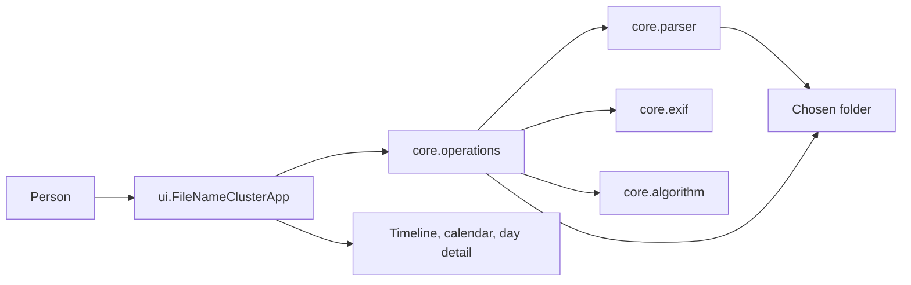
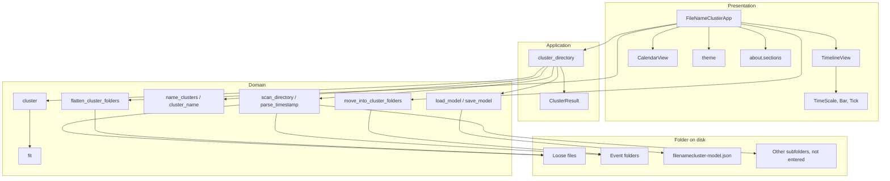
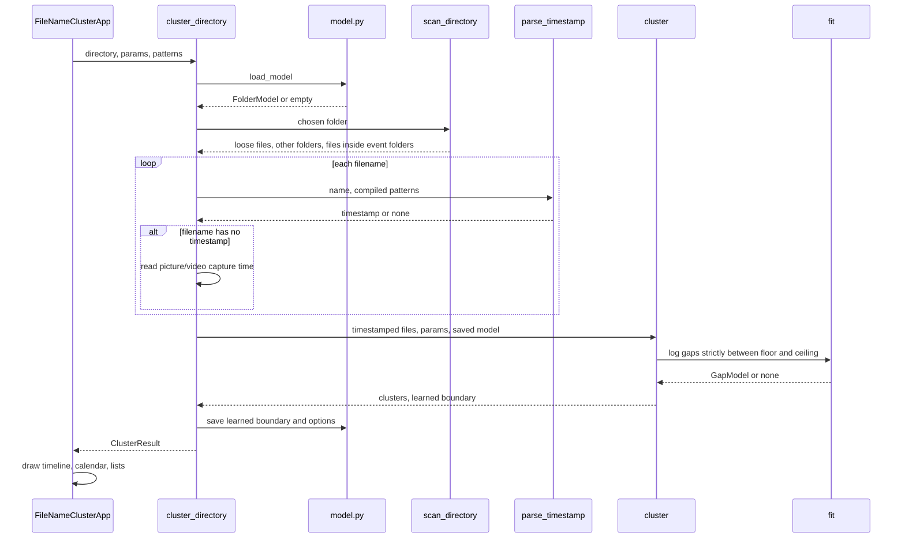
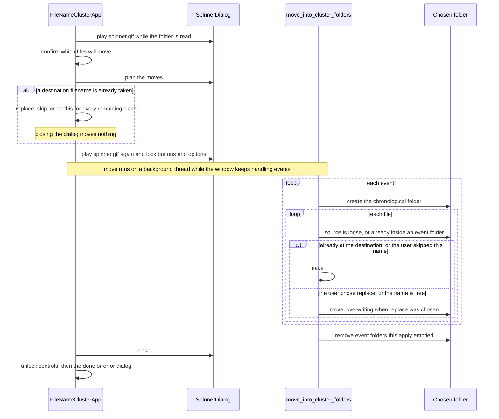

# Architecture

Rajas Chavadekar (rvchavadekar@gmail.com)

The mathematics of the boundary is in [algorithm.md](algorithm.md). This file is the shape of the program: what the pieces are, how a folder moves through them, and which classes own which data.

## High-level design

File Name Cluster is a desktop app. A person picks one folder. The app reads capture times from filenames and, when a name has none, from recognised picture, video, or PDF metadata. It learns one event boundary for that folder, draws the events, and, on confirmation, moves files into one folder per event. A later batch dropped into the same folder is clustered together with the files already filed.

When a filename has no capture time, only that time is read from the picture or video container, or from PDF CreationDate metadata; pixels, GPS, camera details, document contents, and filesystem dates are not read. Unsupported files and files with unreadable capture times are skipped. The model file `filenamecluster-model.json` sits in the chosen folder, visible. It stores the last fitted boundary at full precision under `learned`, and the safety limits, year window, priorities, and filename patterns last used for that folder under `options`. `core/operations/model.py` writes both keys whenever it writes the file. Fitting and reusing the boundary reads only `learned`.

The workspace project is a separate installable that depends on this package and adds `stub`, which only creates or deletes empty stand-in files under `workspace/data`. It is not on the clustering path.

## Component diagram

| Component | Owns | Does not own |
|---|---|---|
| `ui` | Window, options, drawing, confirmation | The decision of where an event boundary is |
| `operations` | `pipeline.py` turns one folder into a `ClusterResult`. `model.py` is the only writer of the JSON. `organize.py` names folders, moves files, and finds a file or an event folder on disk. `notes.py` keeps words added around an event-folder stamp. `options.py` reads option text. `preview.py` scans with saved options. `ledger.py` marks invalid rules through `model.py` | The fit |
| `parser` | Filename clocks and the year window in `patterns.py`; the folder listing in `scan.py` | Clustering |
| `algorithm` | `cluster.py` orders the gaps. `fit.py` fits the mixture and the boundary $\tau$. `split.py` decides each pause | Tk, moving files, the JSON file |
| `exif` | Capture time stored in a picture, video, or PDF. `read.py` chooses the container; `image.py`, `video.py`, `pdf.py`, and `tiff.py` read it. A file with no readable time is skipped | Filenames, clustering |

## Class diagram

`NamedCluster` is not a subclass in code. It carries the same files plus the folder name. The diagram shows that as an extension of the data, not as inheritance.

`TimestampedFile.source` is empty when the file sits directly in the chosen folder. When the file already lives in an event folder, `source` is `event-folder/filename` and `name` stays the filename.

## Low-level design

### Preview

`FileNameClusterApp.refresh` reads the option widgets into a `ClusterParams` and a `TimestampPatterns`, then calls `cluster_directory`. No file is moved.

Inside `cluster` the steps are exactly those in [algorithm.md](algorithm.md): sort, form $g_i$, build $\mathcal{U}$, fit or reuse, then walk the gaps once.

Inside `parse_timestamp`, every enabled rule is tried. A match produces a candidate `(priority, start index, datetime)`. The highest priority wins. A tie keeps the earlier match in the name. A blank expression is off. A clock needs groups `y, mo, d, h, mi, s`. A day-month clock needs `a, b, y, h, mi`. An epoch needs `ms` and is converted with `datetime.fromtimestamp`. A date-only stamp is local midnight. Years outside the window are rejected. The Options tab presents these rules as a table of descriptions and expressions; users can add and remove custom rows.

If filename parsing returns no timestamp, `core.exif` first checks the container signature. Recognised still images are JPEG, PNG, WebP, TIFF, and HEIF/AVIF. Recognised videos are MP4, MOV, M4V, 3GP, and AVI. An embedded EXIF `DateTimeOriginal` is preferred; a video can otherwise use its `mvhd` or `IDIT` creation time. A recognised PDF uses its Info-dictionary `CreationDate` or XMP `CreateDate`. Reads are bounded to the PDF head and tail. The reader is standard-library-only and never deep-scans an arbitrary file. Failure returns `None`, and `pipeline` records that file in `ignored_without_timestamp`.

`scan_directory` lists the chosen folder only one level down. A subdirectory whose name matches an event folder is opened, and only its immediate files are taken. The match allows words before the stamp, after it, or both, such as `Hyderabad trip 4 14-11-2015 16.48.30 to 15-11-2015 13.31.11` or `4 14-11-2015 16.48.30 to 15-11-2015 13.31.11 Hyderabad Trip`. Those words are a note. A space separates the note from the stamp. Text glued to the stamp is not an event folder. The dates inside the stamp are not parsed into times. Any other subdirectory is recorded and not entered. `filenamecluster-model.json` is never treated as media.

### Apply

Apply calls refresh first, so the confirmation dialog describes the clustering of the folder as it is now, including any files copied in since the last preview. That read runs under `SpinnerDialog` before the question is shown. After you confirm, filenames already in the destination are planned under `busy_name_check`. Each one opens `NameClashDialog`: replace that file, skip it, or, when more than one name clashes, do that for all of them. Closing the dialog moves nothing. A `SpinnerDialog` then stays up while `move_into_cluster_folders` runs. Both waits go through `AppController._run_disk`: a daemon thread named `filenamecluster-disk`, polled with `root.after` from the normal event loop, so the operating system does not treat the app as frozen. `AppView.lock_inputs` disables every button, spinbox, checkbox, and language menu, and ignores pattern-cell edits, for that time. The timeline, calendar, and lists stay usable. When a wait finishes, the dialog closes and the controls return to their previous states. The confirmation sits between the two spinners. The done or error dialog follows the move.

Each wait passes its own message key, so the overlay says why it is up:

| Key | When | Clusters calculated |
| --- | --- | --- |
| `busy_open` | After a folder is chosen: saved options are read and every file is dated | Yes |
| `busy_preview` | Update preview, Enter in an option, Restore defaults | Yes |
| `busy_apply_check` | Apply clicked, before the question | Yes |
| `busy_apply` | Apply confirmed, files move into event folders | No |
| `busy_name_check` | After Apply or Flatten is confirmed, before the move: filenames the destination already has | No |
| `busy_flatten_check` | Flatten clicked, event folders are listed before the question | No |
| `busy_flatten` | Flatten confirmed, files move back | No |
| `busy_after_flatten` | After a flatten, for the new preview | Yes |
| `busy_after_error` | After a move fails, to show what is on disk | Yes |

`SpinnerDialog` is a borderless overlay. On macOS its window style is `overlay`, with a `systemTransparent` background and `-transparent`, so the app shows through everything except the animation and the text. An override-redirect window on macOS keeps an opaque backing and paints that same color black, which is why the overlay does not use one there. Windows uses a color key. Linux shows the plain window background, because Tk cannot make only part of a window transparent there. The overlay plays each frame at the delay stored in the GIF, read by `gif_delays`, on a steady clock, and decodes the frames once per window. After a successful move the drawing stays until another folder is chosen.

Folder names:

- one calendar day: `1 24-11-2015 10.01.25 to 18.50.08`
- several days: `2 09-11-2015 20.49.41 to 12-11-2015 10.24.42`

The leading number is the chronological index starting at 1, unpadded. The clock uses dots so the name is a legal folder name.

### Flatten

Flatten uses the same spinners as Apply. The first plays while the event folders are listed, before the confirmation that files will move back. When a folder name has extra words, that confirmation warns that flattening removes those words with the folder. Apply keeps them. After you confirm, the names are planned. Each filename the chosen folder already has is a `NameClash`: the view asks whether to replace the file in the destination or skip it, and, when more than one name clashes, whether to do that for all of them. Closing that dialog cancels the move, and nothing has been moved yet. The move itself then runs under the spinner. `flatten_cluster_folders` considers only immediate subfolders whose names match that pattern, including a name that has a note. A skipped file stays in its event folder, so `rmdir` leaves that folder on disk. A nested directory left inside an event folder does the same. Other subfolders are not touched. The model JSON stays, because it is not inside an event folder.

### A later batch

Copying files into the chosen folder does not start a background watcher. The next `refresh` (Choose folder, Update preview, or the refresh at the start of Apply) rebuilds one sequence:

1. Loose timestamped files in the chosen folder.
2. Timestamped files already inside event folders.

That sequence is fitted again. A new file joins an event when its neighbouring gaps do not split. It starts an event when they do. Apply then moves only the files whose current path is not already the destination, and drops event folders that became empty because their span, and therefore their name, changed. When the old folder name has a note — words before the stamp, after it, or both — the new folder keeps those words around the updated stamp, including when the dates or the leading number change. A loose file in the album has no note and does not vote. The note that is kept is the one on the event folder that already holds the most of that event’s files. When two notes are on the same number of files, the note on the earlier files stays. If one noted folder splits into two events, each new folder receives that same note. The cluster list still shows the computed stamp. The folder on disk keeps the words, and double-click opens that folder. When the destination already has that filename — a loose copy beside the event folders, or a loose file in the way of Flatten — the move stops for a `NameClash` question instead of failing the whole operation. Replace overwrites the destination. Skip leaves both files where they are. The same question is used for Apply and Flatten. `ClashResolver` walks the clashes, `NameClashDialog` writes the choice, and core places the files.

## Descriptive write-up

The package splits along the three jobs the work actually has.

**Read a clock from a name.** `parse` is the only place a filename becomes a `datetime`. The expressions, the year window, and the priorities are data on `TimestampPatterns`, edited from the Options tab and compiled once per scan. Compilation fails closed: a bad expression or a missing named group raises `ValueError` with the field label, and the preview does not change.

**Decide the events.** `fit` in `core/algorithm/fit.py` is a pure function from a list of log-hours to a `GapModel` or `None`. `core/operations/model.py` reads and writes `filenamecluster-model.json`. `cluster` wraps the fit with the floor, the ceiling, the 36-hour fallback, and the reuse of a saved boundary. The fit does not import Tk or touch the filesystem, so the same function can cluster a camera roll held only in memory.

**Put the events on disk and on screen.** `organize` knows the folder-name grammar and the move rules. `pipeline` is the one function the window calls to go from a path to a `ClusterResult`, and it is also the function that writes the JSON. `ui` draws that result and asks before `organize` moves anything. Reading a chosen folder, preparing that question, and moving the files each run off the UI thread, with `spinner.gif` on screen, so a large folder does not look frozen.

The window follows classic MVC. `core` scans, clusters, persists, and moves files without importing `ui`. `AppModel` in `ui/model/model.py` is the single observable application model: chosen folder, authoritative option drafts, pattern rows, preview, selection, status facts, action availability, language, logging, sort, and busy state. `AppView.attach` stores the model and subscribes. `AppView.build` creates the widgets, and `AppView.draw` paints once through `ui/view/render.py`; drawing does not write back. The option rows come from `OptionFields`, so `build` takes no field lists. Callers receive copies of option drafts and pattern rows. Observer topics are the `Topic` enum, and `render.py` handles every topic, including a draft change that does not repaint. Typed values in `ui/model/display.py` carry skipped reasons, learned-boundary facts, calendar days, and separate frozen status variants (`ChooseStatus`, `SummaryStatus`, `OptionProblemStatus`, `ValueProblemStatus`, `ReadFailureStatus`, `PreviewStaysStatus`) without exposing core objects to widgets. `OptionFields` holds the built-in safety-limit rows. `PatternRow` is one filename rule, and `rule_error` in `core/operations` decides whether its expression compiles. `PreviewFacts` produces neutral skipped and learned projections.

`FolderPreview` in `core/operations/preview.py` prepares current drafts, clusters the folder, and records invalid rules as one UI-free operation. A pattern row is `(iid, key, description, pattern, dirty)`; core uses the explicit key and does not infer it from the row id. `FolderPreview.scan` returns a `FolderScan` with `ScanState` and `SavedOptionsState`. `FolderPreviewing` in `ui/controller/previewing.py` dispatches that operation and records its result on `AppModel`. `FolderRelocation` confirms Apply and Flatten and asks core to move the files. `AppController` turns gestures into core calls and model transitions; it neither names widgets nor draws. It sends frozen dialog payloads and `Wait` values. The view maps those to the existing catalog. `AppController._run_disk` delivers `Success` or `Failure`. The controller opens files with `SystemFiles` and applies the logging switch with `SystemLogging`. `FileNameClusterApp` constructs that controller from the model and the view. A test may replace `AppView.run_work` first; folder work then uses that callable instead of the spinner. Option failures are `OptionFault` and `OptionField` values. The view maps them to catalog sentences. `DialogPort`, `FolderPickerPort`, `TaskRunnerPort`, and `DiskPort` make its external needs explicit. `DiskRunner` owns only the spinner, thread, and result delivery. `AppModel.busy` is the one input-lock state, and its notification makes the view lock or unlock controls.

`AppView` builds widgets from section classes that receive the window as an explicit host. The view receives completed projections: `AppModel.calendar_days` decides shared-day ownership, `AppModel.learned_summary` removes the core `GapModel` from the presentation path, and each status variant and skipped-reason enum is translated at the edge. Language has one source of truth on `AppModel`; `i18n.t` is a pure lookup with an explicit language code and has no mutable module locale. Spinbox strings are projections of the authoritative draft strings on `AppModel`. `FileNameClusterApp` attaches the model, binds the controller, builds the window, then draws once. `filenamecluster.log` writes `CALL`, `ENTER`, `EXIT`, `EVENT`, and `DETAIL` lines to the operating system's application-log directory.

The window is one `FileNameClusterApp` on one `tk.Tk`. The timeline and the calendar share cluster indices. Clicking a bar, a calendar day, or a row selects the same event. The cluster list sorts by event number (`#`) or by file count (`Files`). Clicking a heading toggles ascending and descending, shown as ↑ and ↓. The events with the most files are the major ones: sorting `Files` downward brings them to the top. Double-clicking the selected orange or yellow event opens its existing folder in a separate file-manager window; a missing folder produces a localised warning. Double-clicking a Day detail row resolves the file's current loose or event-folder path and asks the operating system to open it with the default application. The timeline scale is in `layout.TimeScale`: one day is a constant number of pixels, so a gap on screen is the gap in time. Zoom changes that constant. The calendar colours a day by the event that owns it.

Options are not a second clustering mode. They are the inputs of the same functions: `ClusterParams.floor`, `ClusterParams.ceiling`, and the fields of `TimestampPatterns`. Restore defaults writes the built-in values back into the widgets and refreshes. The tab keeps filename patterns across the top. Below that, a horizontal split holds three resizable columns: safety limits, the year window, and the read-only model table. The horizontal sash sets how tall the pattern row is. The two vertical sashes set the column widths. Every pane stretches when the window grows. There is no scrolling column of stacked sections.

The same tab shows a read-only table of `filenamecluster-model.json`. The rows are `learned.within_hours`, `learned.between_hours`, `learned.boundary_hours`, and `learned.separated`. Values come from `PreviewFacts.learned_cells` after a preview, formatted with `json.dumps` so the digits match the file. `true`, `false`, and `null` are the JSON literals. Before a folder is chosen the cells show an em dash. The table has no editor. A language change refreshes the headings and the meaning column.

`main` enables process DPI awareness before creating Tk, and sharpens Tk scaling against the display backing scale. The app opens as a normal 1360x880 window. The packaged macOS app also declares high-resolution capability. Tests use withdrawn Tk roots and suppress requests that could map a test window.

Failure stays local. An unreadable folder sets the status line. A destination filename that already exists is a `NameClash`, not an error: the user replaces or skips it, and can apply that answer to every remaining clash. Closing the dialog leaves the folder untouched. A move that the disk itself rejects still reports `OSError`. Calling the move without a replace set still raises `FileExistsError` before anything is moved, so a caller that does not ask cannot overwrite by surprise. A model file that cannot be written is skipped; the preview still appears. A model file that is not valid JSON, or whose `learned` object is missing fields, loads as no saved boundary. A missing or unusable `options` object leaves the built-in defaults in place and does not discard a valid `learned` object. A log file that cannot be opened does not stop the preview.

`ui` contains `app.py` and `__init__.py`. The calendar is `ui/view/calendar.py`. The timeline, its geometry, the theme, and the About text are the other modules in `ui/view`. Language catalogs are `ui/assets/i18n`, loaded by `ui/view/i18n`. Session state is `ui/model/model.py`. Clicks and file opening are `ui/controller`.

Each file holds one responsibility and stays under 10 KB. `AppView` is composed from section classes, one file each, that own their widgets and take the window as an explicit host: `ClustersTab` (`clusters_tab.py`), `OptionsTab` (`options_tab.py`), `PatternTable` (`pattern_table.py`), `EqualColumns` (`columns.py`), `InfoTabs` (`info_tabs.py`), `Messages` (`messages.py`), and `WidgetKit` (`widgets.py`). `TimelineView` in `timeline.py` keeps the widget, zoom, and clicks. `TimelinePainter` and `describe_zoom` in `timeline_draw.py` draw the lanes. `AppController` holds `PatternEdits` (`pattern_edits.py`), `OpenActions` (`opening.py`), `FolderPreviewing` (`previewing.py`), and `FolderRelocation` (`relocation.py`). Controllers change `AppModel` and do not draw. The window listens and draws each `Topic` from prepared values. Disk work uses `AppView.run_work`, which maps a `Wait` value to the spinner sentence. `SystemLogging` applies the logging switch recorded on `AppModel`. `AppModel` mixes in `PreviewFacts`. Successful Apply calls `set_actions_and_status` with a `PreviewStaysStatus` and does not rescan. If any filename was skipped because the destination already had it, Apply refreshes instead, so those files stay visible. `FolderPreview`, `OptionReader`, and `RuleLedger` live in `core/operations`. `RuleLedger.mark` calls `keep_rules` in `model.py`, and `save_model` uses the same writer.

A pattern row whose regular expression does not compile is painted with the orange used for the selected cluster (`theme.SELECTED_FILL`, tag `invalid` in `PatternTable`). `OptionReader.read` leaves it out of the scan and returns its row id. The status line adds "Invalid filename patterns left out: n". After the scan, `RuleLedger.mark` updates `options.rules` through `core/operations/model.py`, adding `"invalid": true` to each bad row, so the row comes back, still orange, when the folder is chosen again. The loader ignores that extra key. `FolderPreview` drops invalid saved rules before the first scan.

Tests mirror the source tree file for file. `src/filenamecluster/a/b/component.py` is tested by `tests/a/b/test_component.py`, and there is no other test file. `__main__.py` is tested by `tests/test_main.py`. Package `__init__.py` files only re-export, so they have no test file. Window tests share `WindowCase` from `tests/conftest.py`, which builds a withdrawn app over a temporary folder of photos. pytest runs with `--import-mode=importlib`, so two test files can share a name in different folders. Model persistence lives in `core/operations/model.py`. The fit, including `EM_ROUNDS`, lives in `core/algorithm/fit.py`. The build driver is the `filenamecluster/build` package, beside `src` and `tests`, run as `uv run python -m build`. `cli.py` reads the arguments and runs the steps. `log.py` writes every step to stderr at debug level, which is what a CI job keeps. `nuitka.py` holds `NuitkaBuild`, the command for each operating system. Nuitka writes its own output. `tcl.py` holds `PythonInstall`, `TclBundle`, and `windows_bundle`, which find or unpack the Tcl and Tk library for Windows. `macos.py` marks the Mac app high resolution. `paths.py` names the project folders. Its tests are `tests/build/test_<module>.py`, with `tests/build/test_main.py` for `__main__.py`. pytest's `norecursedirs` leaves out `build` so those tests are collected.

The icon shown by the window is `filenamecluster/src/filenamecluster/ui/assets/icon.svg`, rasterized to `icon.png` beside it because Tk’s `PhotoImage` loads the PNG. `spinner.gif` in that same folder is the animation played by `SpinnerDialog` after a folder is chosen and both before and after the Apply and Flatten confirmations. The frozen build copies both files in next to the package.

## UI element map

Every control on the window, the module that builds it, and the function that runs when it is used. `FileNameClusterApp` in `ui/app.py` builds `AppModel`, `AppView`, and `AppController`, then `AppView.bind` attaches the controller before `AppView.build`. Words on the widgets come from `ui/view/i18n`, which reads `ui/assets/i18n`. A language change calls `AppView._on_language`, then `AppController.language_chosen`, which stores the code on `AppModel`. The model notification redraws every translated projection with that explicit code.

### Window shell

| What you see | Built by | What runs |
| --- | --- | --- |
| Process DPI awareness, before the window exists | `ui/app.py` `main` | `ui.view.theme.prepare_process_dpi` |
| Window, 1360×880, minimum 1040×680 | `AppView.build` | `tk.Tk` created in `main`; `root.mainloop` |
| Window icon | `AppView._install_icon` | `tk.PhotoImage` of `ui/assets/icon.png` from `_icon_path` |
| Title bar text and the large title | `AppView.build`, `AppView._build_header` | Catalog key `app_title`. `retranslate` sets `root.title` again |
| Folder path under the title | `AppView._build_header` label bound to `folder_text` | `AppController.load_folder` writes the path. With no folder, `retranslate` writes the empty-state phrase |
| Language label | `AppView._build_header` | Label only |
| Language menu | `AppView._build_header` combobox bound to `language_var` | `<<ComboboxSelected>>` → `AppView._on_language` → `AppController.language_chosen` → `AppModel.set_language` → `AppView.retranslate`. `i18n.t` receives that code explicitly |
| Choose folder… | `AppView._build_header` | `AppController.choose_folder` → `tkinter.filedialog.askdirectory`. After a folder is chosen, `load_folder` plays the spinner and runs `_preview_saved_folder` on the background thread |
| Flatten clustering | `AppView._build_header` | Starts disabled. `AppController.flatten_clustering` shows the spinner, then `_confirm_flatten` asks, then plans names. A name the folder already has opens the replace-or-skip dialog. The spinner then plays again for the move |
| Apply clustering | `AppView._build_header` | Starts disabled. `AppController.apply_clustering` shows the spinner, then `_confirm_apply` asks, then plans names. A name the destination already has opens the replace-or-skip dialog. The spinner then plays again for the move |
| Status line along the bottom | `AppView.build` label bound to `status_text` | `AppModel.status` stores semantic facts; `Messages.paint_status` translates and draws them. A language change draws them again |
| Four tabs | `AppView._add_tab` on `ttk.Notebook` | Tab titles refresh in `AppView.retranslate` |

After a scan, `AppController._show_result` fills the timeline, calendar, cluster list, day detail, skipped list, and learned-model table, and enables Apply when there is at least one event. Flatten is enabled when the folder already contains an event-folder name.

### Clusters tab

The tab is `AppView._build_clusters_tab`. The three lower panes sit in a horizontal `ttk.Panedwindow`. Dragging a sash is Tk; there is no app handler on those sashes.

| What you see | Built by | What runs |
| --- | --- | --- |
| Timeline frame and its caption | `AppView._build_clusters_tab` | Caption only |
| Whole-folder timeline | `ui.view.timeline.TimelineView`, stored as `overview` | `TimelineView.show` from `_show_result`. Bars and ticks are drawn by `TimelineView._draw` using `ui.view.layout.TimeScale` |
| − | `TimelineView.__init__` | `TimelineView.zoom_out` |
| + | `TimelineView.__init__` | `TimelineView.zoom_in` |
| Fit | `TimelineView.__init__` | `TimelineView.fit` |
| Zoom caption | `TimelineView` label | `timeline_draw.describe_zoom`, refreshed by `TimelineView.retranslate` |
| Timeline canvas | `TimelineView` | Click on a bar: `TimelineView._clicked` → `on_select` → `AppController.select_cluster`. Click on empty scale: `_clicked` → `on_time` → `AppController._timeline_clicked` → `_day_clicked`. Double-click the selected bar: `TimelineView._double` → `on_open` → `AppController.open_cluster_folder` |
| Timeline horizontal scrollbar | `TimelineView` | Canvas `xview` |
| Timeline vertical scrollbar | `TimelineView` | Canvas `yview` |
| Plain mouse wheel | `TimelineView._wheel` | Scrolls sideways. Shift-wheel uses the same handler |
| Ctrl or Cmd with the wheel | `TimelineView._zoom_wheel` | Zooms. Button-4 and Button-5 call `TimelineView._scroll` |
| Calendar frame | `AppView._build_clusters_tab` | `ui.view.calendar.CalendarView` |
| ◀◀ | `CalendarView.__init__` | `CalendarView.previous_event_month` |
| ◀ | `CalendarView.__init__` | `CalendarView.move(-1)` via `calendar.shift_month` |
| Month title | `CalendarView` label | `CalendarView.show_month` / `redraw` |
| ▶ | `CalendarView.__init__` | `CalendarView.move(1)` |
| ▶▶ | `CalendarView.__init__` | `CalendarView.next_event_month` |
| Day cells | `CalendarView.redraw` and `_draw_cell` | Colour and counts come from `AppModel.calendar_days`. Click: `CalendarView._clicked` → `day_at` → `on_day` → `AppController.day_chosen`. Double-click the selected event’s day: `CalendarView._double` → `on_open` → `open_cluster_folder` |
| Cluster list frame | `AppView._build_clusters_tab` | Caption only |
| # heading | `AppView._tree` column `number` | `AppController.sort_clusters`. Arrow text is `AppView._cluster_heading_text` |
| Folder name heading | column `name` | Heading only. It does not sort |
| Files heading | column `files` | `AppController.sort_clusters`. Row order is `AppModel.cluster_order`, drawn by `ClustersTab._apply_cluster_sort` |
| Cluster rows | `AppController._show_result` inserts them | Select: `<<TreeviewSelect>>` → `AppController._tree_selected` → `select_cluster`. Double-click the selected row: `AppController._tree_double` → `open_cluster_folder` |
| Cluster list scrollbar | `AppView._tree` | Tree `yview` |
| Day detail frame | `AppView._build_clusters_tab`, stored as `day_frame` | Caption from `AppView._day_title` inside `AppController.show_day` |
| Day timeline | second `TimelineView`, stored as `day_view` | Same zoom, wheel, and drawing as the overview. Clicking a bar calls `select_cluster` with `show_day=False`. Double-click opens the folder through `open_cluster_folder` |
| Time, File, and Event columns | `day_tree` from `AppView._tree` | Filled by `AppController.show_day` from `AppModel.files_by_day` |
| A file row | `day_tree` | Double-click: `AppController._day_file_double` → `open_day_file` |
| Day-detail scrollbar | `AppView._tree` | Tree `yview` |

`select_cluster` keeps one index on the overview, the day timeline, the calendar, and the cluster list. `show_day` sets `AppModel.selected_day`, calls `CalendarView.select_day`, and redraws `day_view` for that calendar day.

### Options tab

The tab is `AppView._build_options_tab`. The pattern block and the three columns are `tk.PanedWindow` panes from `AppView._split`.

| What you see | Built by | What runs |
| --- | --- | --- |
| Update preview | bottom button bar | `AppController.refresh` → `OptionReader` → `core.operations.pipeline.cluster_directory` |
| Restore defaults | bottom button bar | `AppController.restore_defaults` → `AppView.reset_options` → `refresh`. Logging stays as it is |
| Write application log | `logging_switch` checkbox, `logging_var`, off at startup | `AppController._logging_toggled` → `filenamecluster.log.set_logging_enabled`. This is not written into the model file |
| Horizontal sash above the three columns | `options_rows` | Tk resize. `AppView._reflow` and `_flowing_help` wrap the hint text |
| Filename patterns caption and help | pattern `LabelFrame` | Help text only |
| Description and Pattern columns | `pattern_tree` | Double-click: `PatternTable._edit_pattern_cell` → `_begin_pattern_edit`. Commit: `PatternEdits.pattern_committed` → `AppView.mark_pattern`, which paints the row orange when it does not compile |
| Validate column | `pattern_tree` column `validate`, one cell on every row | Click: `PatternTable._validate_clicked` → `PatternEdits.validate_pattern` → `rule_error`. The window opens the alert |
| Cell editor | temporary `ttk.Entry` | Return or focus-out: commit inside `_begin_pattern_edit`. Escape: cancel. The editor shows the stored wording. `AppModel.update_cell` marks a built-in description dirty when that wording changes |
| Add pattern | button under the table | `PatternEdits.add_pattern_rule` → `AppModel.add_custom` → `AppView.begin_edit`, which opens the editor on the new row |
| Remove pattern | button under the table | `PatternEdits.remove_pattern_rule` → `AppModel.remove_rows` |
| Pattern scrollbar | `AppView._tree` | Tree `yview` |
| Vertical sashes between the three columns | `options_columns` | A sash drag calls `AppView._mark_columns_user_sized` and stays put. Until then, `Configure` → `_balance_options_grid` → `_finish_equal_columns` → `_place_equal_columns`. `AppView.build` also schedules `_finish_equal_columns` once the window is idle |
| Never split before | spinbox `option_vars["floor"]` | `OptionReader` → `ClusterParams.floor`. Enter calls `refresh` |
| Always split after | spinbox `option_vars["ceiling"]` | `OptionReader` → `ClusterParams.ceiling`. Enter calls `refresh` |
| Safety-limit hints | labels under the spinboxes | `AppView._reflow` wraps them |
| Minimum year | `limit_vars["min_year"]` | `OptionReader` → `TimestampPatterns.min_year` |
| Maximum year | `limit_vars["max_year"]` | `OptionReader` → `TimestampPatterns.max_year` |
| Clock priority | `limit_vars["prec_clock"]` | `OptionReader` → `TimestampPatterns.prec_clock` |
| Epoch priority | `limit_vars["prec_epoch"]` | `OptionReader` → `TimestampPatterns.prec_epoch` |
| Date priority | `limit_vars["prec_date"]` | `OptionReader` → `TimestampPatterns.prec_date` |
| Year-window hints | labels under those spinboxes | `AppView._reflow` |
| Learned model caption and help | model `LabelFrame` | Help text only. The table does not edit |
| Parameter, Value, Meaning | `model_tree` | `PreviewFacts.learned_cells` supplies the four display rows: `learned.within_hours`, `learned.between_hours`, `learned.boundary_hours`, and `learned.separated` |
| Learned-model scrollbar | `AppView._tree` | Tree `yview` |

Every safety-limit and year-window spinbox is built by `AppView._option_row`. Enter in any of them calls `refresh`.

Choosing a folder calls `_preview_saved_folder` on the background thread. That loads `core.operations.model.load_model`, scans with the saved options when they compile, and otherwise uses the built-in defaults. Back on the UI thread, `_finish_folder_load` calls `_apply_saved_options` when the saved options were used. `cluster_directory` writes both `learned` and `options` through `core.operations.model.save_model`.

### Skipped tab

| What you see | Built by | What runs |
| --- | --- | --- |
| Intro sentence | `AppView._build_skipped_tab` | Label only |
| Name and Reason columns | `skipped_tree` | `AppView._fill_skipped` |
| A subfolder row | filled from `ClusterResult.ignored_directories` | A name that contains an event-folder stamp, with or without words around it, is left off this list. Any other subfolder is listed. `core.operations.organize.is_cluster_folder_name` chooses |
| A file row | filled from `ClusterResult.ignored_without_timestamp` | The file had no usable filename clock and no usable picture, video, or PDF creation time |
| Scrollbar | `AppView._tree` | Tree `yview` |

### About tab

| What you see | Built by | What runs |
| --- | --- | --- |
| Scrolling text | `AppView._build_about_tab` `tk.Text`, tag `heading` | `AppView._fill_about` → `ui.view.about.sections` |
| Vertical scrollbar | `AppView._build_about_tab` | Text `yview` |

`about.sections` walks `about.SECTION_KEYS`. Each heading and body is a catalog string. The logging body receives the path from `filenamecluster.log.log_path`. Regex bodies are passed through `str.format` so brace counts in the recipes stay literal. The sections, in order, are: what this does, how to use it, reading the views, folder names, which files are used, options, filename patterns, the little marks, four kinds of time, the camera-photo example, the scanned-page example, the pattern table, the application log, and author and documents.

### Dialogs

| What you see | Opened by | What runs next |
| --- | --- | --- |
| Choose the folder to cluster | `AppController.choose_folder` | After a folder is chosen, the spinner plays while `load_folder` reads it |
| Apply confirmation | `AppController._confirm_apply` | Shown after the reading spinner. Yes → plan the moves, then `NameClashDialog` for each filename the destination already has, then a `SpinnerDialog` and `move_into_cluster_folders`. No, or closing a clash dialog → nothing is moved |
| Nothing to move | `apply_clustering` when there are no events | Dialog only |
| Could not move | `apply_clustering` on `OSError` or `ValueError` | Then `refresh` |
| Applied | `apply_clustering` after a successful move | Apply is disabled. Flatten is enabled. The drawings stay |
| Wait overlay, with `spinner.gif` | `ui.view.spinner.SpinnerDialog`, opened by `DiskRunner` from `AppController._run_disk` | On macOS an `overlay` window with a `systemTransparent` background, so there is no black box and no title bar. Windows uses `-transparentcolor`. Linux uses `overrideredirect` and the plain background. Large bold text from the `busy_*` key passed to `_run_disk`. Frame delays come from `gif_delays`. It does not grab the rest of the window |
| Buttons, spinboxes, the logging switch, and the language menu | `AppView.lock_inputs` | Disabled while the spinner is up. Pattern cells ignore double-click. `AppView.unlock_inputs` restores the earlier state, including a button that was already disabled |
| Flatten confirmation | `AppController._confirm_flatten` | Shown after the reading spinner. When a folder name has extra words, the question warns that those words are removed with the folder. Yes → plan the moves, then the same replace-or-skip dialog, then a `SpinnerDialog` and `flatten_cluster_folders` |
| Nothing to flatten | `flatten_clustering` when no event folder is present | Dialog only |
| Could not flatten | `flatten_clustering` on `OSError` or `ValueError` | Then `refresh` |
| Folder has not been created | `AppController.open_cluster_folder` when `organize.event_folder` finds no directory | `ui.controller.files.open_folder_window` when it does |
| File cannot be opened | `AppController.open_day_file` when `organize.locate_file` returns nothing | `SystemFiles.open_file` when a path exists |

`open_file` uses `open` on macOS, `os.startfile` on Windows, and `xdg-open` elsewhere. `open_folder_window` uses Finder via `osascript` on macOS, Explorer on Windows, and `xdg-open` elsewhere. The path of a file already moved by Apply is resolved by `core.operations.organize.locate_file`.

### Paint and type, shared by the controls

| Concern | Module | Function |
| --- | --- | --- |
| Colours, clam theme, fonts | `ui.view.theme` | `apply`, called from `AppView.__init__`. `sharpen` runs inside `apply` |
| Script-specific fonts after a language change | `ui.view.theme` | `use_script`, called from `AppView.retranslate` |
| One day in a constant number of pixels | `ui.view.layout` | `TimeScale`, plus the tick iterators it uses |
| Session: folder, options, preview, selection, language, logging | `ui.model.model` | `AppModel` |
| Hours shown in the safety-limit spinboxes | `ui.model.options` | `OptionFields.hours`. The spinbox rows are `OptionFields.FIELDS` and `OptionFields.LIMITS`; `AppView.build` does not receive them |
| Learned-boundary sentence on the status line | `ui.view.i18n` | `describe_model`, used by `AppView._summary` |

## Troubleshooting

| What you see | What it means | What to try | Where it lives |
| --- | --- | --- | --- |
| The status line says to choose a folder, and Apply stays disabled | No folder is loaded, so `refresh` returns without scanning | Choose folder… | `AppController.refresh`, `choose_folder` |
| A pattern row is orange, and the status line says invalid filename patterns were left out | That recipe does not compile | Fix the recipe, or clear it to turn the row off. The other rows still scan, and the row is saved marked `invalid` | `rule_error`, `OptionReader`, `RuleLedger`, `FolderPreviewing.refresh` |
| Update preview does not change the drawings, and the status line names a pattern row | The recipe compiles, but its named groups are not one of the four kinds | Fix the named groups. The previous preview is kept | `OptionReader`, `core.parser` compile, `AppController.refresh` |
| A spinbox is blank or out of range, and the status line says so | The safety limits, years, or priorities could not be read | Type a number inside the range shown for that field, then Update preview | `OptionReader`, `AppController.refresh` |
| A stamp you can see in the name is ignored | The year is outside Minimum year and Maximum year, or the clock is impossible, such as month 13 | Widen the year window or correct the name, then Update preview | `core.parser` year window and clock checks; spinboxes in `AppView._build_options_tab` |
| A file is on the Skipped tab | The name had no usable clock, and picture, video, or PDF creation time could not be read. A row that is a folder was not entered | Rename to a supported pattern, or leave the file. Other subfolders are never entered. A folder whose name contains the event dates is not listed, because its files are already in the events | `AppView._fill_skipped`, `PreviewFacts.skipped`, `core.operations.pipeline`, `core.exif`, `core.parser.scan_directory` |
| Two events should have been one, or one event should have been two | The learned boundary, or a safety limit, split or kept that pause | Raise Never split before to force short pauses together. Lower Always split after to force long pauses apart. Update preview. The boundary itself is still fitted from pauses | `OptionReader`, `core.algorithm.cluster`, `core.algorithm.fit` |
| The learned-model table shows null | This folder has no saved boundary yet, usually because there were too few pauses to fit one | Preview a folder with more gaps. The four cells are only `learned` | `PreviewFacts.learned_cells`, `core.operations.model.load_model` |
| An old model file has no options, or options look wrong | Missing or unusable `options` fall back to the built-in defaults. A valid `learned` object is kept | Update preview writes a fresh `options` object beside `learned` | `core.operations.model.load_model`, `_preview_saved_folder`, `AppController._finish_folder_load` |
| Choosing the folder does not restore the limits you typed last time | Those values are written when a preview or apply saves the model. A preview that fails on a bad recipe does not save | Make the recipes valid and Update preview | `core.operations.pipeline.cluster_directory`, `core.operations.model.save_model` |
| The model file is missing after a preview, or the status mentions that it could not be saved | The preview still stands. Saving the JSON failed and was skipped | Check that the folder is writable | `core.operations.model.save_model`, `core.operations.pipeline` |
| The spinner has a solid box behind it on Linux | Tk on X11 cannot make only part of a window transparent | Expected. macOS and Windows show only the animation and the text | `ui.view.spinner._transparent_background` |
| The operating system says the app is not responding after Choose folder, Apply, or Flatten | The read or the move used to run on the UI thread, so the event loop stopped | The Please wait dialog plays `spinner.gif` while the folder is read, before either confirmation, and again after you confirm while files move. `AppController._run_disk` does that work on a background thread and polls it with `root.after`. Buttons and option controls are locked. The timeline, calendar, and lists still respond | `ui.view.spinner.SpinnerDialog`, `AppView.lock_inputs`, `core.operations.pipeline.cluster_directory`, `core.operations.organize` |
| Apply or Flatten says the destination already has a file named … | That filename is already in the destination, so the move is waiting for replace or skip | Replace overwrites the destination. Skip leaves both files. Check “Do this for all (n) conflicts” to use one answer for the rest. Close the dialog to move nothing | `NameClashDialog`, `ClashResolver`, `core.operations.placement` |
| Apply asks, then says it could not move | The disk rejected the move | Check that the folder is writable. The error dialog is followed by a fresh preview | `core.operations.organize.move_into_cluster_folders`, `AppController.apply_clustering` |
| Flatten says it could not flatten | The disk rejected the move back | Check that the folder is writable, then Flatten again | `core.operations.organize.flatten_cluster_folders` |
| Flatten says there is nothing to flatten | No immediate subfolder matches an event-folder name | Apply first, or the folders were already flattened | `AppController.flatten_clustering`, `is_cluster_folder_name` |
| The cluster list shows dates, while the folder on disk also has extra words | The list shows the computed stamp. The words before or after those dates stay on the folder | Double-click still opens that folder. Apply keeps the words when the dates change. When two worded folders become one event, the words kept are from the folder that held more of the photos. The same count keeps the words on the earlier photos. Flatten warns that the words are removed | `core.operations.notes`, `core.parser.folders`, `AppController.open_cluster_folder` |
| Double-clicking an event says the folder has not been created | Apply has not created that folder yet. The preview only draws | Apply clustering, then double-click again | `AppController.open_cluster_folder` |
| Double-clicking a file says it cannot be opened | The loose path and the event-folder path are both missing | The file was removed after the preview. Update preview | `AppController.open_day_file`, `core.operations.organize.locate_file` |
| Double-click opens the wrong application, or no window | The operating system chooses the application | Change the system association for that file type. The app calls `open`, `os.startfile`, or `xdg-open` | `SystemFiles.open_file`, `SystemFiles.open_folder_window` |
| The log file has no new lines | Write application log is off, or the log directory could not be created. A failed log never stops the preview | Turn the switch on. It starts off, and it is not stored in the model file. The About tab shows this computer’s full path | `AppController._logging_toggled`, `filenamecluster.log.configure`, `log_path` |
| The window text is in the wrong language | The menu selects a catalog. Unknown codes stay on English | Pick the language again. Catalogs must share keys with English or the app refuses to start | `AppController.language_chosen`, `ui.view.i18n` |
| Type looks soft on a high-resolution display | Tk scaling did not match the display | `main` calls `prepare_process_dpi` before creating Tk, and `theme.apply` calls `sharpen` | `ui.view.theme` |
