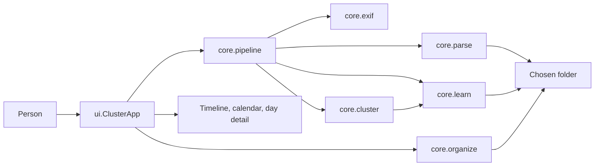
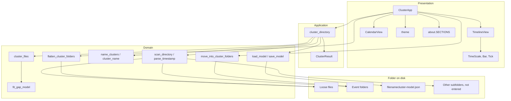
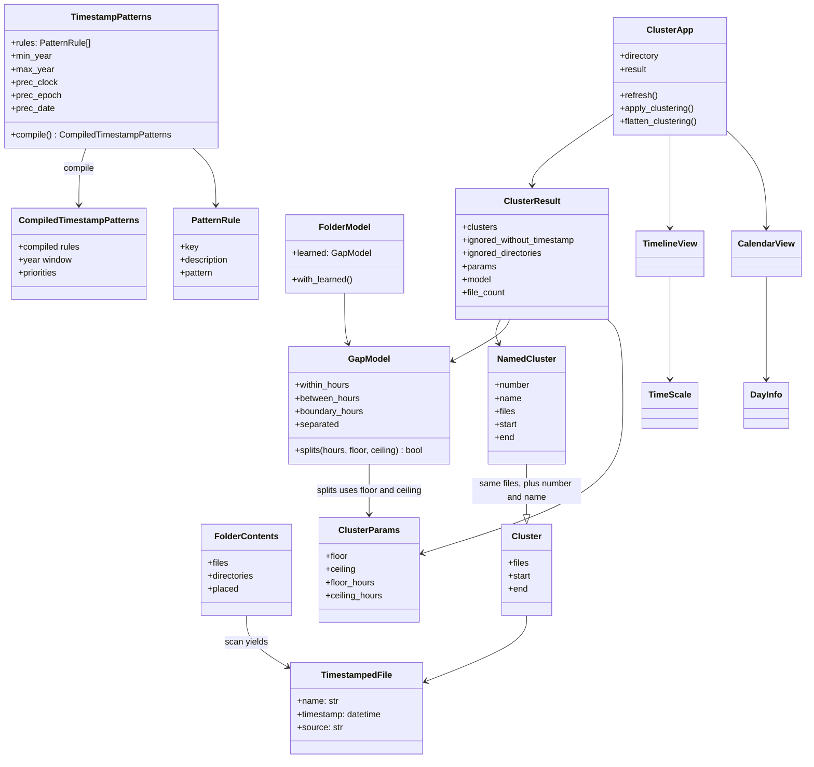
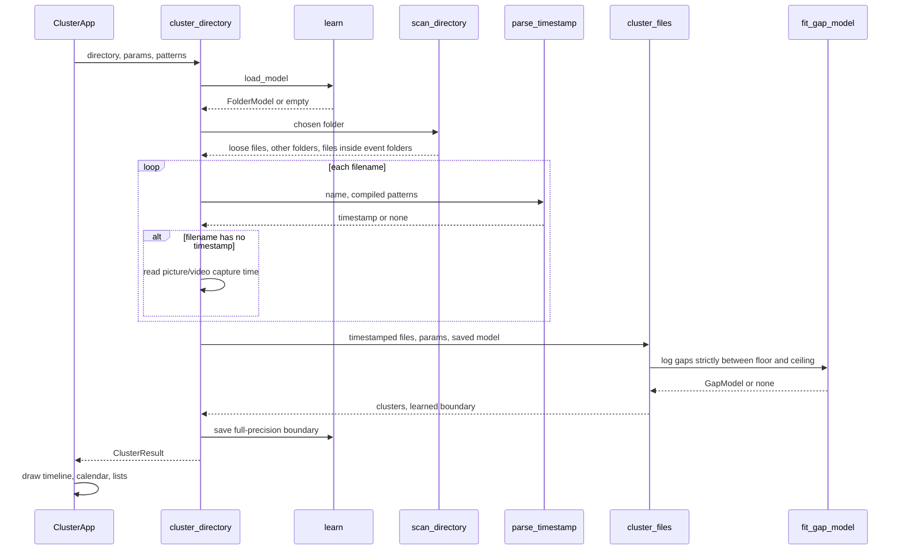
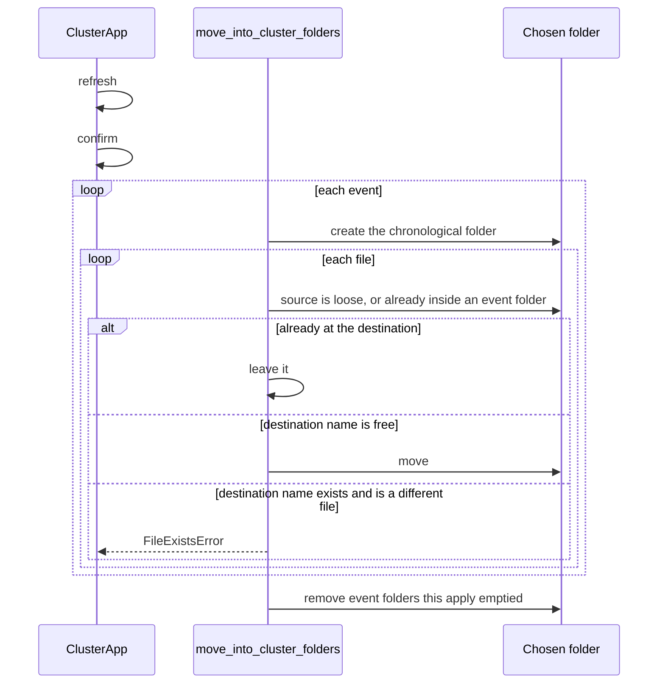

# Architecture

Rajas Chavadekar (rvchavadekar@gmail.com)

The mathematics of the boundary is in [algorithm.md](algorithm.md). This file is the shape of the program: what the pieces are, how a folder moves through them, and which classes own which data.

## High-level design

File Name Cluster is a desktop app. A person picks one folder. The app reads capture times from filenames and, when a name has none, from recognised picture, video, or PDF metadata. It learns one event boundary for that folder, draws the events, and, on confirmation, moves files into one folder per event. A later batch dropped into the same folder is clustered together with the files already filed.

When a filename has no capture time, only that time is read from the picture or video container, or from PDF CreationDate metadata; pixels, GPS, camera details, document contents, and filesystem dates are not read. Unsupported files and files with unreadable capture times are skipped. The model file `filenamecluster-model.json` sits in the chosen folder, visible, and stores the last fitted boundary at full precision. It is written by `learn`.

The workspace project is a separate installable that depends on this package and adds `stub`, which only creates or deletes empty stand-in files under `workspace/data`. It is not on the clustering path.

## Component diagram

| Component | Owns | Does not own |
|---|---|---|
| `ui` | Window, options, drawing, confirmation | The decision of where an event boundary is |
| `pipeline` | One scan turned into a `ClusterResult` | Moving bytes |
| `parse` | Filename clocks, year window, top-level listing plus event-folder listing | Clustering |
| `learn` | The mixture, the boundary $\tau$, and the visible JSON | Tk, moving files |
| `cluster` | Safety limits and the join-or-split rule | How a folder is named |
| `organize` | Chronological folder names, move, flatten | The fit |
| `exif` | Capture time stored in a picture, video, or PDF. A file with no readable time is skipped | Filenames, clustering |

## Class diagram

`NamedCluster` is not a subclass in code. It carries the same files plus the folder name. The diagram shows that as an extension of the data, not as inheritance.

`TimestampedFile.source` is empty when the file sits directly in the chosen folder. When the file already lives in an event folder, `source` is `event-folder/filename` and `name` stays the filename.

## Low-level design

### Preview

`ClusterApp.refresh` reads the option widgets into a `ClusterParams` and a `TimestampPatterns`, then calls `cluster_directory`. No file is moved.

Inside `cluster_files` the steps are exactly those in [algorithm.md](algorithm.md): sort, form $g_i$, build $\mathcal{U}$, fit or reuse, then walk the gaps once.

Inside `parse_timestamp`, every enabled rule is tried. A match produces a candidate `(priority, start index, datetime)`. The highest priority wins. A tie keeps the earlier match in the name. A blank expression is off. A clock needs groups `y, mo, d, h, mi, s`. A day-month clock needs `a, b, y, h, mi`. An epoch needs `ms` and is converted with `datetime.fromtimestamp`. A date-only stamp is local midnight. Years outside the window are rejected. The Options tab presents these rules as a table of descriptions and expressions; users can add and remove custom rows.

If filename parsing returns no timestamp, `core.exif` first checks the container signature. Recognised still images are JPEG, PNG, WebP, TIFF, and HEIF/AVIF. Recognised videos are MP4, MOV, M4V, 3GP, and AVI. An embedded EXIF `DateTimeOriginal` is preferred; a video can otherwise use its `mvhd` or `IDIT` creation time. A recognised PDF uses its Info-dictionary `CreationDate` or XMP `CreateDate`. Reads are bounded to the PDF head and tail. The reader is standard-library-only and never deep-scans an arbitrary file. Failure returns `None`, and `pipeline` records that file in `ignored_without_timestamp`.

`scan_directory` lists the chosen folder only one level down. A subdirectory whose name matches an event folder is opened, and only its immediate files are taken. Any other subdirectory is recorded and not entered. `filenamecluster-model.json` is never treated as media.

### Apply

Apply calls refresh first, so the confirmation dialog describes the clustering of the folder as it is now, including any files copied in since the last preview. After a successful move the drawing stays until another folder is chosen.

Folder names:

- one calendar day: `1 24-11-2015 10.01.25 to 18.50.08`
- several days: `2 09-11-2015 20.49.41 to 12-11-2015 10.24.42`

The leading number is the chronological index starting at 1, unpadded. The clock uses dots so the name is a legal folder name.

### Flatten

`flatten_cluster_folders` considers only immediate subfolders whose names match that pattern. It plans every move first. If any filename already exists in the chosen folder, nothing is moved. Otherwise each file is moved up and the event folder is removed when `rmdir` succeeds. A nested directory left inside an event folder keeps that folder on disk. Other subfolders are not touched. The model JSON stays, because it is not inside an event folder.

### A later batch

Copying files into the chosen folder does not start a background watcher. The next `refresh` (Choose folder, Update preview, or the refresh at the start of Apply) rebuilds one sequence:

1. Loose timestamped files in the chosen folder.
2. Timestamped files already inside event folders.

That sequence is fitted again. A new file joins an event when its neighbouring gaps do not split. It starts an event when they do. Apply then moves only the files whose current path is not already the destination, and drops event folders that became empty because their span, and therefore their name, changed.

## Descriptive write-up

The package splits along the three jobs the work actually has.

**Read a clock from a name.** `parse` is the only place a filename becomes a `datetime`. The expressions, the year window, and the priorities are data on `TimestampPatterns`, edited from the Options tab and compiled once per scan. Compilation fails closed: a bad expression or a missing named group raises `ValueError` with the field label, and the preview does not change.

**Decide the events.** `learn` is a pure function from a list of log-hours to a `GapModel` or `None`. `cluster` wraps that with the floor, the ceiling, the 36-hour fallback, and the reuse of a saved boundary. Neither module imports Tk or touches the filesystem. That is why the same function can cluster a camera roll held only in memory.

**Put the events on disk and on screen.** `organize` knows the folder-name grammar and the move rules. `pipeline` is the one function the window calls to go from a path to a `ClusterResult`, and it is also the function that writes the JSON. `ui` draws that result and asks before `organize` moves anything.

The window is one `ClusterApp` on one `tk.Tk`. The timeline and the calendar share cluster indices. Clicking a bar, a calendar day, or a row selects the same event. Double-clicking the selected orange or yellow event opens its existing folder in a separate file-manager window; a missing folder produces a localised warning. Double-clicking a Day detail row resolves the file's current loose or event-folder path and asks the operating system to open it with the default application. The timeline scale is in `layout.TimeScale`: one day is a constant number of pixels, so a gap on screen is the gap in time. Zoom changes that constant. The calendar colours a day by the event that owns it.

Options are not a second clustering mode. They are the inputs of the same functions: `ClusterParams.floor`, `ClusterParams.ceiling`, and the fields of `TimestampPatterns`. Restore defaults writes the built-in values back into the widgets and refreshes. The tab keeps filename patterns across the top. Below that, a horizontal split holds three resizable columns: safety limits, the year window, and the read-only model table. The horizontal sash sets how tall the pattern row is. The two vertical sashes set the column widths. Every pane stretches when the window grows. There is no scrolling column of stacked sections.

The same tab shows a read-only table of `filenamecluster-model.json`. The rows are `learned.within_hours`, `learned.between_hours`, `learned.boundary_hours`, and `learned.separated`. Values come from `ClusterResult.model` after a preview, formatted with `json.dumps` so the digits match the file. `true`, `false`, and `null` are the JSON literals. Before a folder is chosen the cells show an em dash. The table has no editor. A language change refreshes the headings and the meaning column.

`main` enables process DPI awareness before creating Tk, and sharpens Tk scaling against the display backing scale. The app opens as a normal 1360x880 window. The packaged macOS app also declares high-resolution capability. Tests use withdrawn Tk roots and suppress requests that could map a test window.

Failure stays local. An unreadable folder sets the status line. A move that would overwrite stops and reports `FileExistsError` or `OSError`. A model file that cannot be written is skipped; the preview still appears. A model file that is not valid JSON, or whose `learned` object is missing fields, loads as no saved boundary.

The calendar implementation is `ui/calendar.py`; the former `calendar_view.py` name no longer exists. Model persistence lives in `core/learn.py`; there is no separate `model_file.py`. The only build driver is `filenamecluster/build.py`, beside `pyproject.toml`.

The icon shown by the window is `filenamecluster/src/filenamecluster/ui/assets/icon.svg`, rasterized to `icon.png` beside it because Tk’s `PhotoImage` loads the PNG.
